Author: Troy Shurtleff
Copyright 2019 BAE Systems
SPDX-License-Identifier: Apache-2.0

---
[TOC]

---
Approved for public release; unlimited distribution
Not export controlled per ES-FL-091619-0203

---

<div style="page-break-after: always;"></div>
# Reverse Engineering Virtual Machine Configuration

This document and the associated source code is intended for course instructors only.  There are no spoilers here, but the steps here are not a part of the reverse engineering exercise.

This document describes how to configure the Reverse Engineering VM used for the "Reverse Engineering the Variable Message Sign" exercise.

This document is accompanied by the `install_re_tools.sh` file which automates installation of additional tools and dependencies.

## System Information

### Host Software Information

Hypervisor: Oracle VirtualBox 6.0

- [https://www.virtualbox.org/](https://www.virtualbox.org/)
  - Download: https://www.virtualbox.org/wiki/Downloads
    - Follow the instructions based on your host operating system

### Guest Software Information

- Operating System: Ubuntu 18.04.3 LTS (Desktop Image)
  - [http://releases.ubuntu.com/18.04.3/](http://releases.ubuntu.com/18.04.3/)
    - Download: http://releases.ubuntu.com/18.04.3/ubuntu-18.04.3-desktop-amd64.iso
    - SHA-1: 7a68f0ed496e01ca5adaf439c806ad57328b7c9d
- Software RE Suite: Ghidra 9.0.4
  - [https://ghidra-sre.org/releaseNotes_9.0.4.html](https://ghidra-sre.org/releaseNotes_9.0.4.html)
    - Download: https://ghidra-sre.org/ghidra_9.0.4_PUBLIC_20190516.zip
    - SHA-256: a50d0cd475d9377332811eeae66e94bdc9e7d88e58477c527e9c6b78caec18bf
- Linux System Builder: Buildroot 2019.02.4 (long term support release)
  - [https://buildroot.org/download.html](https://buildroot.org/download.html)
    - Download: https://buildroot.org/downloads/buildroot-2019.02.4.tar.gz
- Some additional tools and dependencies are also installed.  Review the `install_re_tools.sh` script associated with this document for details.

### Virtual Hardware Information

- RAM: 4096 MB
- Hard Drive: 30 GB (virtual size, actual size is smaller)
- Processors: 2

## Configuration Instructions

### Create the Virtual Machine

In the Oracle VM Virtual Box Manager window choose `Machine` &#8594;  `New...` to start the Create Virtual Machine wizard.

Populate the first screen as shown below.  Configure the Machine Folder in a way that is appropriate for your host machine.

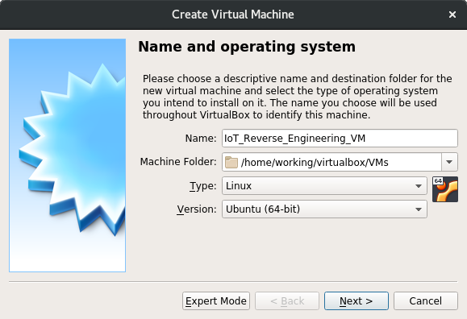

Specify a memory size of 4096 MB.

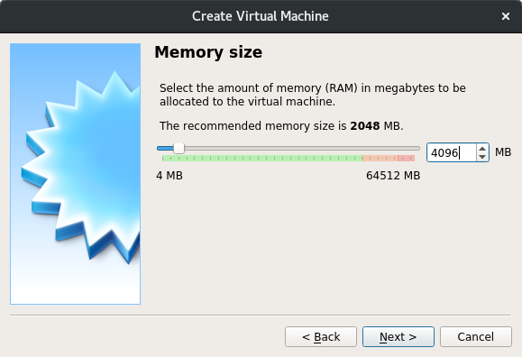

Choose "Create a virtual hard disk now."

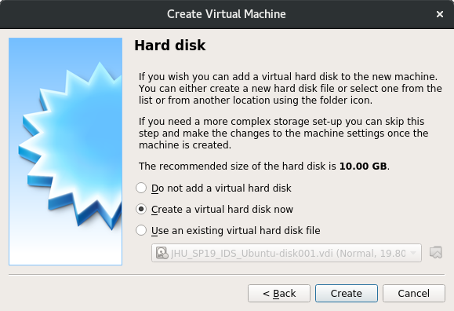

Choose a VDI file to contain the virtual hard disk.


Choose a dynamically allocated disk.  This will conserve storage space and performance is sufficient for our needs.


Specify a size of 30 GB for the hard disk.  The actual size will be smaller.  After specifying the size click `Create` to create the VM.

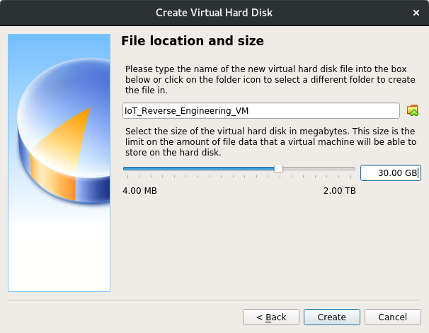

Edit the settings for the newly created VM and change `Shared Clipboard` and `Drag'n'Drop` to `Bidirectional`.  This will make completing the exercise easier because students will be able to copy and paste between their VM and host machine.

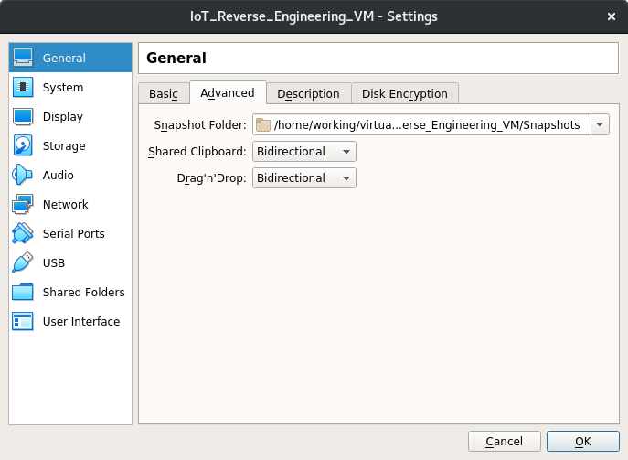

Change number of processors to 2.  This may marginally increase performance when building the VMS system and doing analysis in Ghidra.

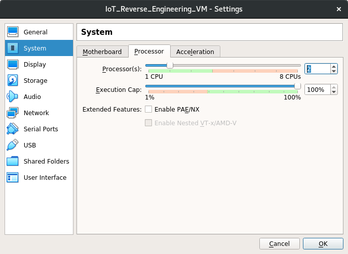

Change the `Graphics Controller` to `VBoxVGA` (from `VMSVGA`).  This setting helped resolve a compatibility issue when running the VM on a Windows-based host.

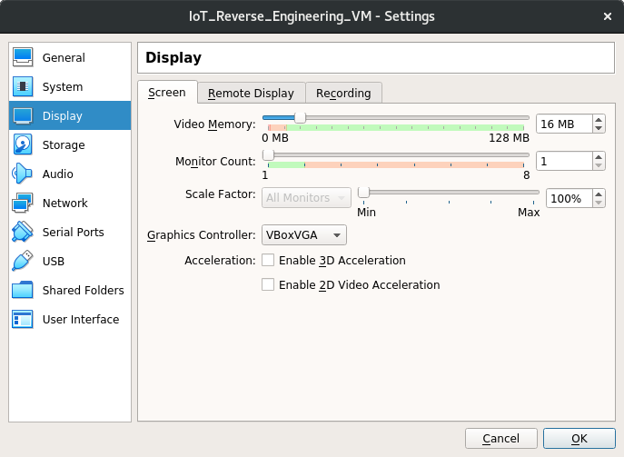

Uncheck `Enable Audio`.  Audio is not needed for the exercise and this setting helped resolve a compatibility issue when running the VM on a Windows-based host.

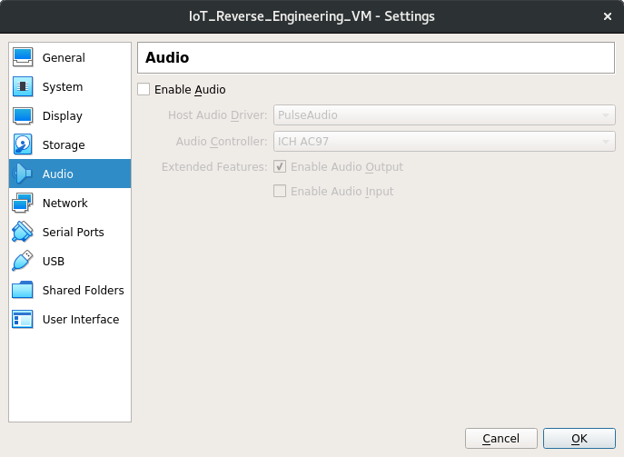

### Install Ubuntu 18.04

Click the optical disk icon (blue disk in the upper right) and choose the Ubuntu 18.04.3 ISO file (download location is above).


Power on the VM and choose `Install Ubuntu` from the Welcome screen.

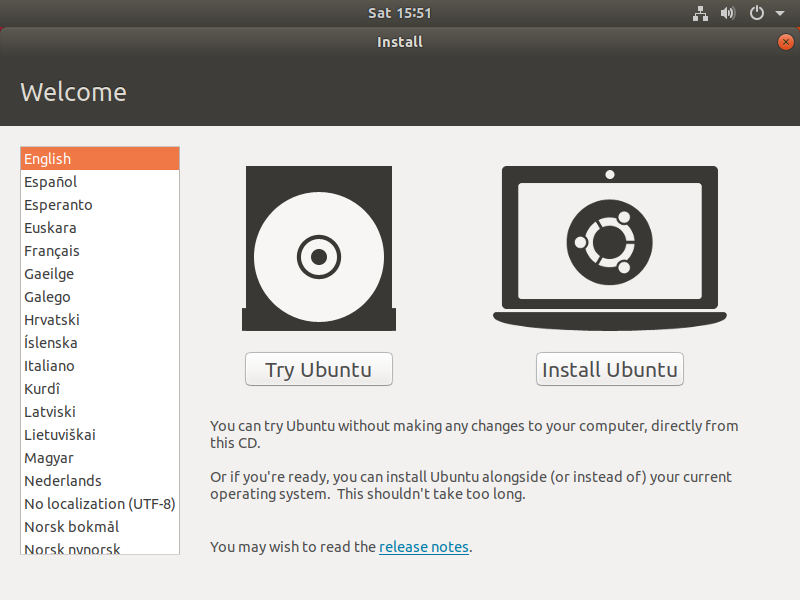

Select the keyboard layout.

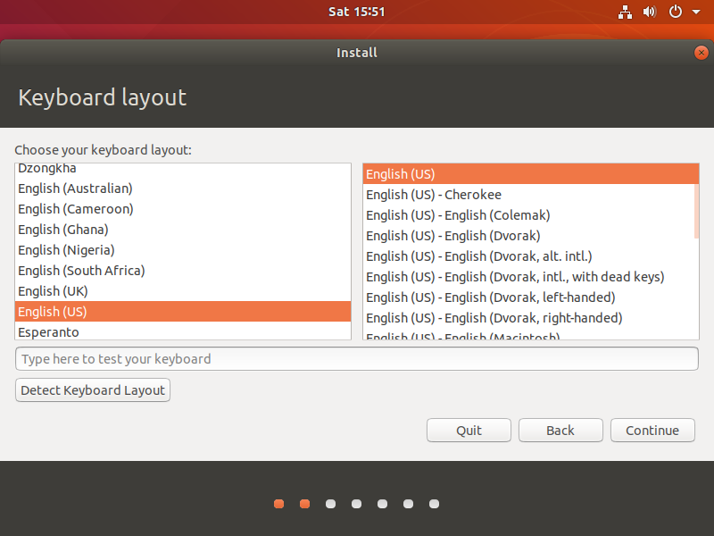

Choose the `Minimal installation` radio button.  Uncheck the `Download updates while installing Ubuntu` checkbox (this is intended to yield a more consistent and repeatable configuration).  


Select the `Erase disk and install Ubuntu` option.  We will use the default partitioning configuration.  Then, click `Install Now`


Click `Continue` at the warning prompt.


Specify your location information.

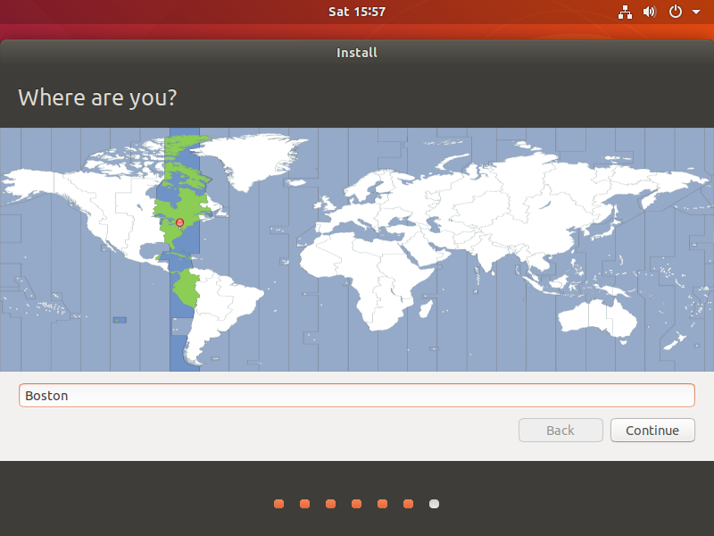

Populate the "Who are you" information as shown below.  Enter the password `student`.  Note that the `revm` hostname stands for "Reverse Engineering VM."


Progress information is displayed during the install.


After the Ubuntu installation completes you will be prompted to restart.  Before you restart, go back into the storage configuration for the VM and remove the Ubuntu ISO.

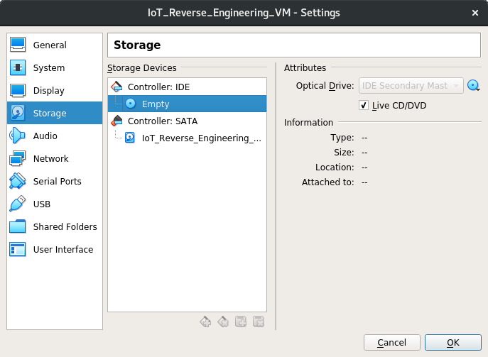

Click `Restart Now` after removing the Ubuntu ISO from the VM.

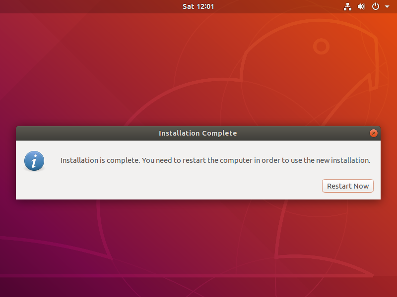

After the restart you will be presented with a login prompt.

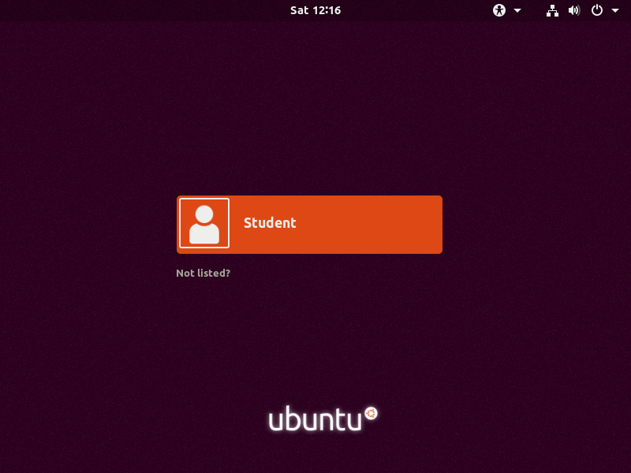

### Install Virtual Box Guest Additions

Login to the VM with the username `student` and password `student`.  Click through the "What's new in Ubuntu" demonstration and open a new terminal window.  Install the Dynamic Kernel Module Support Framework by running the `sudo apt -y install dkms` command.  DKMS is required by the Virtual Box guest additions.

Choose the `Devices` -> `Insert Guest Additions CD image...` menu option in the Virtual Box IoT_Reverse_Engineering_VM window.  Click `Run` when you see the prompt below then enter the password `student` when prompted.

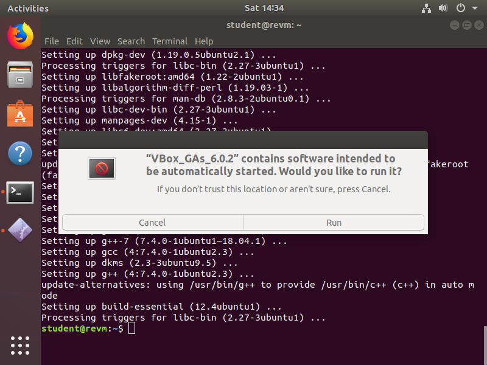

When the Guest Addition install is complete you will see the output below.  Press <kbd>Enter</kbd> to close the window then reboot the VM.

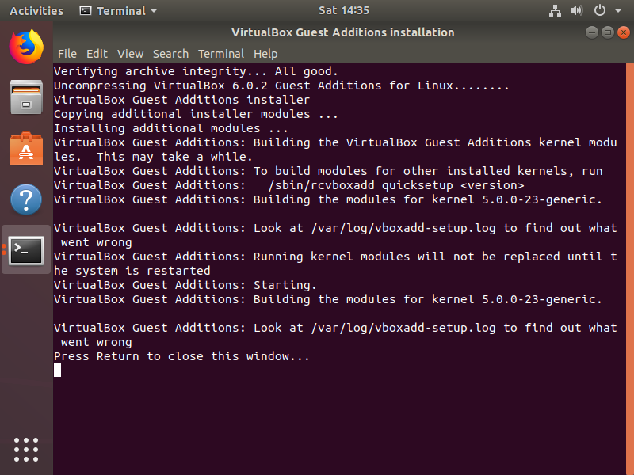

### Install Additional Reverse Engineering Tools

Before you login open the VirtualBox File Manager by choosing ` Machine` -> `File Manager...` from the Virtual Box IoT_Reverse_Engineering_VM window.

At the bottom of the File Manager window enter the username `student` and password `student` then click the `Create Session` button.

In the left pane, browse to the folder on your host machine containing this document (it will contain a script called `install_re_tools.sh`).  In the right pane browse to the /home/student folder on the guest machine.

The File Manager window should look like the one shown below.

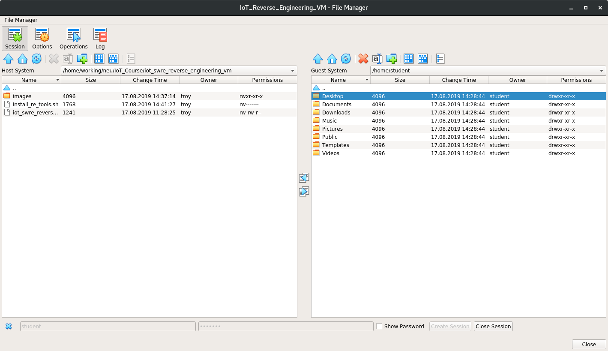

Click on the `install_re_tools.sh` script on the left (the host side) then click the button in the middle to copy the file from the host to the guest.

Login to the Reverse Engineering VM.  You will see the icon for the VBox Guest Additions CD on the desktop.  Right click the icon and choose `Eject` (alternatively you can eject the CD using the Virtual Box storage menu under the VM settings).  Open a terminal window and run the following commands to install additional reverse engineering tools (e.g. Ghidra, QEMU, Buildroot).  The install will take a few minutes.

```
student@revm:~$ chmod u+x install_re_tools.sh 
student@revm:~$ sudo ./install_re_tools.sh 
```

When the install completes click the launcher in the lower left (it looks like nine dots) then type `ghidra` in the search box.  Right click on the Ghidra icon and choose `Add to Favorites`.  Also, add the terminal to Favorites.

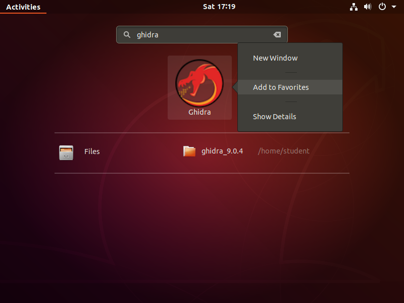

Reboot the Reverse Engineering VM.

### Build the Variable Message Sign System

Refer to the instructions in the "Building the Variable Message Sign System" document for instructions to build the exercise-specific VMS system.

If there is an update to the `signApp` ELF file this is the point to incorporate it.

### Export the Reverse Engineering VM Appliance

After building the Variable Message Sign System the Reverse Engineering VM is almost in a state that is ready for students to begin the "Reverse Engineering the Variable Message Sign" exercise.

Before exporting the VM, disable the network adapter.  Uncheck `Enable Network Adapter` for `Adapter 1` in the Network settings for the VM (the other adapters should already be disabled).  The network adapter is not needed to complete the exercise; however, it is needed to prepare the Reverse Engineering VM because the `install_re_tools.sh` script we ran earlier downloads some software (e.g. Ghidra, QEMU, Buildroot).


Next, disable the automatic updates to ensure a consistent configuration for all the students.  Click the launcher in the lower left (it looks like nine dots) then type `Software & Updates` in the search box.  Next, click on the Software & Updates icon.

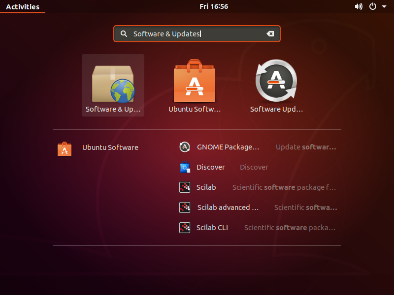

In the Software & Updates application Click the `Updates` tab.  Set `Automatically check for updates` to `Never`.  Enter the password `student` when requested.  Click `Close`.

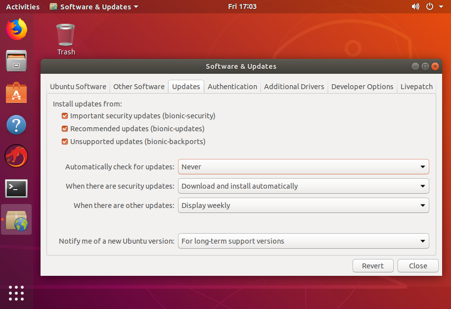

Power off the VM before proceeding.

At this point the machine should be exported in OVA format for distribution to students.  To do this, select the VM in the Oracle VM VirtualBox Manager window then chose `File` &#8594; `Export Appliance...` from the menu at the top.  At the "Virtual machines to export" dialog choose the `IoT_Reverse_Engineering_VM` then click `Next >`.  In the "Appliance settings" dialog choose `Open Virtualization Format 1.0`, `Include only NAT network adapter MAC addresses`, and check `Write Manifest File`.  Also, specify an output file location.  On the "Virtual system setting" dialog leave the descriptive information as populated and click `Export`.

The export process may take approximately 10 minutes and progress information is displayed during the export.  The exported OVA file will be approximately 4.7 GB.

## Update the Vulnerable signApp

The `signApp` binary implements the VMS administrative interface.  If updates to this application are desired refer to the "Building the Vulnerable signApp" document.  Note that building the `signApp` is a bit of a chicken or the egg problem.  The build procedure for the `signApp` uses some of the tools prepared by the Buildroot build environment for the VMS.  The intent is not to provide the source code of the `signApp` to students because that would trivialize part of the exercise.  Ideally, updates to the `signApp` would be built on an instructor instance of the Reverse Engineering VM and only the `signApp` ELF file would be included in the student machine instances.

---
Author: Troy Shurtleff
Copyright 2019 BAE Systems
SPDX-License-Identifier: Apache-2.0

Approved for public release; unlimited distribution
Not export controlled per ES-FL-091619-0203